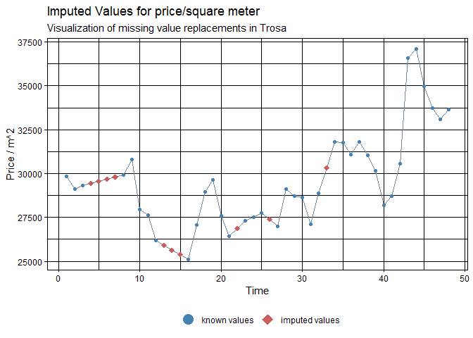

Covid-19 Pandemic & The Swedish House Market
================
Benjamin Sivac
2022-03-24

``` r
library(imputeTS)
library(missForest)
library(tidyverse)
library(janitor) # row to names
```

Cleaned data with assigned numbers for population density.

``` r
df.condos <- read.table("Data_condos.csv", header = TRUE, sep = ",", dec = ".")
```

``` r
df.condos %>% glimpse()
```

    ## Rows: 290
    ## Columns: 53
    ## $ LK                      <int> 114, 115, 117, 120, 123, 125, 126, 127, 128, 1~
    ## $ InvÃ.nare..2021M08.     <int> 47500, 34243, 47699, 46086, 82579, 29103, 1138~
    ## $ befolkningstÃ.thet.2020 <chr> "629,1", "95,4", "149,3", "102,6", "1510,9", "~
    ## $ Indelning.typ.3         <int> 3, 2, 3, 2, 3, 2, 3, 3, 3, 3, 3, 3, 2, 3, 3, 3~
    ## $ OmrÃ.desnamn            <chr> "Upplands-Väsby", "Vallentuna", "ÖsterÃ¥ker"~
    ## $ X201710                 <dbl> 35013.56, 32528.11, 34855.81, 42240.81, 36343.~
    ## $ X201711                 <dbl> 34920.88, 31183.23, 35228.07, 41004.91, 36583.~
    ## $ X201712                 <dbl> 34255.21, 29797.39, 35251.92, 41519.01, 37174.~
    ## $ X201801                 <dbl> 32925.71, 28988.09, 33425.52, 40975.59, 37427.~
    ## $ X201802                 <dbl> 32347.05, 29698.51, 31801.48, 41169.08, 36360.~
    ## $ X201803                 <dbl> 32659.92, 29252.91, 31773.60, 40370.16, 36101.~
    ## $ X201804                 <dbl> 32935.01, 29296.69, 31649.51, 40269.73, 35249.~
    ## $ X201805                 <dbl> 32891.09, 29544.41, 32669.59, 40043.36, 34843.~
    ## $ X201806                 <dbl> 32104.99, 29575.25, 32314.79, 40048.78, 34497.~
    ## $ X201807                 <dbl> 32522.04, 30100.27, 33244.47, 41377.02, 35865.~
    ## $ X201808                 <dbl> 33022.18, 29582.23, 36574.61, 41113.41, 35395.~
    ## $ X201809                 <dbl> 32808.28, 29823.45, 36528.60, 41046.68, 35744.~
    ## $ X201810                 <dbl> 32507.66, 29076.42, 35632.81, 40133.23, 35461.~
    ## $ X201811                 <dbl> 32045.37, 29312.78, 32854.60, 40014.46, 35670.~
    ## $ X201812                 <dbl> 32927.56, 30153.52, 31743.93, 39956.87, 34649.~
    ## $ X201901                 <dbl> 32770.40, 30677.29, 32021.69, 39723.65, 34397.~
    ## $ X201902                 <dbl> 32551.12, 30960.09, 31443.75, 39510.07, 34440.~
    ## $ X201903                 <dbl> 32338.54, 29957.23, 31544.90, 39799.74, 34631.~
    ## $ X201904                 <dbl> 32312.04, 30866.91, 32272.63, 40270.38, 34006.~
    ## $ X201905                 <dbl> 32140.72, 29852.11, 32834.68, 46577.51, 33844.~
    ## $ X201906                 <dbl> 31815.12, 31096.31, 32784.60, 47519.47, 33864.~
    ## $ X201907                 <dbl> 32614.55, 32216.35, 32020.92, 47399.86, 33946.~
    ## $ X201908                 <dbl> 32813.95, 33187.88, 32546.12, 43063.41, 34967.~
    ## $ X201909                 <dbl> 32684.88, 33781.97, 34766.55, 41420.65, 34260.~
    ## $ X201910                 <dbl> 31791.67, 32483.54, 34901.70, 41510.33, 34363.~
    ## $ X201911                 <dbl> 31191.40, 32567.14, 35326.73, 39896.37, 33644.~
    ## $ X201912                 <dbl> 32323.28, 31268.32, 34929.49, 41623.10, 34759.~
    ## $ X202001                 <dbl> 33087.08, 32792.09, 36030.64, 41926.23, 35306.~
    ## $ X202002                 <dbl> 33651.08, 32924.58, 36628.06, 41830.90, 35486.~
    ## $ X202003                 <dbl> 33004.45, 32048.19, 34226.98, 41980.56, 34379.~
    ## $ X202004                 <dbl> 32361.08, 30432.11, 32400.97, 42176.44, 33868.~
    ## $ X202005                 <dbl> 31577.89, 29612.27, 32529.62, 43411.09, 33786.~
    ## $ X202006                 <dbl> 32151.20, 29716.05, 32452.49, 42737.82, 34986.~
    ## $ X202007                 <dbl> 33861.80, 30321.69, 36254.44, 42913.06, 35420.~
    ## $ X202008                 <dbl> 34007.19, 31993.32, 36720.74, 43000.53, 36049.~
    ## $ X202009                 <dbl> 33358.10, 32482.35, 37636.42, 44640.53, 36192.~
    ## $ X202010                 <dbl> 32904.49, 34277.35, 37538.42, 44868.83, 36483.~
    ## $ X202011                 <dbl> 33359.60, 33736.67, 36918.27, 44968.39, 36586.~
    ## $ X202012                 <dbl> 34220.58, 34840.12, 37688.44, 44766.70, 36939.~
    ## $ X202101                 <dbl> 34196.71, 35088.70, 36510.32, 44870.53, 37091.~
    ## $ X202102                 <dbl> 34832.87, 36398.22, 35937.05, 45702.72, 37195.~
    ## $ X202103                 <dbl> 35032.32, 36581.41, 35666.01, 46192.77, 37587.~
    ## $ X202104                 <dbl> 35145.81, 35888.17, 36282.31, 47926.59, 37701.~
    ## $ X202105                 <dbl> 35046.21, 37092.03, 38002.16, 49417.83, 37932.~
    ## $ X202106                 <dbl> 35010.72, 37552.40, 38660.44, 49993.39, 38095.~
    ## $ X202107                 <dbl> 36323.37, 38557.16, 38866.78, 50688.37, 38395.~
    ## $ X202108                 <dbl> 36282.16, 35466.35, 38391.72, 50989.64, 38140.~
    ## $ X202109                 <dbl> 36422.88, 34901.83, 38006.43, 51217.64, 37575.~

``` r
# Wide data format, lots of zeroes (presumably NA values)
```

``` r
df.condos[df.condos == 0] <- NA
df.sub <- df.condos %>% select(-c(2,3,4,5)) # Also remove useless columns (for now)
df.sub_t <- df.sub %>% t() %>% as.data.frame()
df.sub_t <- df.sub_t %>% row_to_names(row_number = 1)
```

``` r
df.sub_t %>% glimpse()
```

    ## Rows: 48
    ## Columns: 290
    ## $ `114`  <dbl> 35013.56, 34920.88, 34255.21, 32925.71, 32347.05, 32659.92, 329~
    ## $ `115`  <dbl> 32528.11, 31183.23, 29797.39, 28988.09, 29698.51, 29252.91, 292~
    ## $ `117`  <dbl> 34855.81, 35228.07, 35251.92, 33425.52, 31801.48, 31773.60, 316~
    ## $ `120`  <dbl> 42240.81, 41004.91, 41519.01, 40975.59, 41169.08, 40370.16, 402~
    ## $ `123`  <dbl> 36343.76, 36583.91, 37174.14, 37427.02, 36360.26, 36101.71, 352~
    ## $ `125`  <dbl> 38720.57, NA, NA, NA, NA, NA, NA, NA, 37163.36, 39814.84, 40589~
    ## $ `126`  <dbl> 38495.51, 38819.90, 38102.93, 38407.14, 37902.34, 38056.27, 384~
    ## $ `127`  <dbl> 33495.86, 33385.59, 32254.47, 31003.07, 30460.41, 30288.48, 305~
    ## $ `128`  <dbl> 30749.02, 30601.72, 30130.49, 28832.69, 28206.49, 28786.12, 305~
    ## $ `136`  <dbl> 35606.49, 32872.13, 32194.56, 31156.26, 30712.77, 30051.64, 296~
    ## $ `138`  <dbl> 41116.86, 38933.58, 38573.22, 34321.50, 35065.60, 35613.69, 366~
    ## $ `139`  <dbl> 30309.76, 31077.07, 30832.34, 29976.48, 29603.67, 28288.51, 294~
    ## $ `140`  <dbl> NA, NA, NA, NA, NA, 32170.74, 33464.13, 33881.82, NA, NA, 34194~
    ## $ `160`  <dbl> 43993.46, 42164.52, 42182.52, 43309.58, 42881.40, 42042.68, 407~
    ## $ `162`  <dbl> 58125.89, 56718.43, 56142.96, 57068.09, 56066.27, 56338.91, 558~
    ## $ `163`  <dbl> 42418.96, 41179.89, 40803.31, 40625.42, 41701.63, 40659.99, 404~
    ## $ `180`  <dbl> 70562.30, 68107.90, 67550.63, 68033.12, 68158.03, 68393.47, 683~
    ## $ `181`  <dbl> 27994.13, 26874.50, 26659.20, 26612.33, 26266.22, 28494.69, 293~
    ## $ `182`  <dbl> 53116.17, 51689.94, 51644.67, 50053.17, 50055.92, 49601.50, 496~
    ## $ `183`  <dbl> 56766.40, 56054.02, 55385.96, 55050.23, 54459.21, 53226.83, 518~
    ## $ `184`  <dbl> 56323.53, 54435.75, 53867.57, 54432.23, 54870.58, 54798.12, 545~
    ## $ `186`  <dbl> 56730.31, 55532.25, 53722.94, 54879.65, 54245.22, 53307.94, 519~
    ## $ `187`  <dbl> 41337.83, 41226.38, 41046.62, 40334.44, 40023.85, 38465.25, 410~
    ## $ `188`  <dbl> 26577.96, 25546.10, 24792.66, 25282.88, 26035.88, 26538.18, 261~
    ## $ `191`  <dbl> 31233.94, 28876.46, 28123.98, 28876.40, 29916.80, 29825.95, 290~
    ## $ `192`  <dbl> 25964.83, 25916.61, 25933.84, 25954.39, 25102.39, 24912.46, 247~
    ## $ `305`  <dbl> 26610.01, 26986.42, 31893.80, 30220.26, 28159.06, 26288.16, 252~
    ## $ `319`  <dbl> NA, NA, NA, NA, NA, NA, NA, NA, NA, NA, NA, NA, NA, NA, NA, NA,~
    ## $ `330`  <dbl> 29153.86, 29771.00, 31467.93, 32485.99, 33343.68, 32400.28, 309~
    ## $ `331`  <dbl> NA, NA, NA, NA, NA, NA, NA, NA, NA, NA, NA, NA, NA, NA, NA, NA,~
    ## $ `360`  <dbl> 14008.59, 13538.08, NA, NA, 12780.25, 12917.62, 11631.23, 12398~
    ## $ `380`  <dbl> 38771.02, 37883.59, 36936.75, 36535.66, 36429.04, 36673.76, 369~
    ## $ `381`  <dbl> 22482.46, 21947.02, 22105.25, 22683.34, 22503.18, 21974.74, 216~
    ## $ `382`  <dbl> 17926.76, 16473.69, 15132.31, 15823.89, 15631.26, 16334.49, 155~
    ## $ `428`  <dbl> NA, NA, NA, NA, NA, NA, NA, NA, NA, NA, NA, NA, NA, NA, NA, NA,~
    ## $ `461`  <dbl> NA, NA, NA, NA, NA, NA, NA, NA, NA, NA, NA, NA, NA, NA, NA, NA,~
    ## $ `480`  <dbl> 20784.12, 19896.13, 20164.58, 20541.96, 20463.39, 19866.17, 203~
    ## $ `481`  <dbl> 8884.400, NA, NA, NA, 10056.235, 9698.763, 9271.130, 8846.885, ~
    ## $ `482`  <dbl> NA, NA, NA, NA, NA, NA, NA, NA, NA, NA, NA, NA, NA, NA, NA, NA,~
    ## $ `483`  <dbl> 14567.97, 14722.44, 14894.74, 15120.73, 14897.39, 14651.02, 147~
    ## $ `484`  <dbl> 22012.96, 21713.99, 22009.78, 22074.41, 22033.61, 21958.36, 218~
    ## $ `486`  <dbl> 27052.24, 27076.72, 26860.96, 24433.33, 23650.80, 23010.15, 223~
    ## $ `488`  <dbl> 29827.43, 29110.93, 29305.19, NA, NA, NA, NA, 29923.15, 30799.5~
    ## $ `509`  <dbl> NA, NA, NA, NA, NA, NA, NA, NA, NA, NA, NA, NA, NA, NA, NA, NA,~
    ## $ `512`  <dbl> NA, NA, NA, NA, NA, NA, NA, NA, NA, NA, NA, NA, NA, NA, NA, NA,~
    ## $ `513`  <dbl> NA, NA, NA, NA, NA, NA, NA, NA, NA, NA, NA, NA, NA, NA, NA, NA,~
    ## $ `560`  <dbl> NA, NA, NA, NA, NA, NA, NA, NA, NA, NA, NA, NA, NA, NA, NA, NA,~
    ## $ `561`  <dbl> NA, NA, NA, NA, NA, NA, NA, NA, NA, NA, NA, NA, NA, NA, NA, NA,~
    ## $ `562`  <dbl> 8406.528, 8170.556, NA, 7920.464, 8117.486, 7800.216, 7699.889,~
    ## $ `563`  <dbl> NA, NA, NA, NA, NA, NA, NA, NA, NA, NA, NA, NA, NA, NA, NA, NA,~
    ## $ `580`  <dbl> 33672.84, 33977.15, 33382.88, 32984.96, 29796.32, 29756.39, 297~
    ## $ `581`  <dbl> 24585.26, 24579.47, 24696.97, 24543.98, 24597.27, 24549.73, 242~
    ## $ `582`  <dbl> NA, NA, NA, NA, NA, NA, NA, NA, NA, NA, NA, NA, NA, NA, NA, NA,~
    ## $ `583`  <dbl> 13020.78, 12699.45, 12901.98, 12527.80, 12353.56, 12626.15, 131~
    ## $ `584`  <dbl> NA, NA, NA, NA, NA, NA, NA, NA, NA, NA, NA, NA, NA, NA, NA, NA,~
    ## $ `586`  <dbl> 16882.61, 16961.88, 16813.44, 13993.51, 13927.76, 13757.51, 144~
    ## $ `604`  <dbl> NA, NA, NA, NA, NA, NA, NA, NA, NA, NA, NA, NA, NA, NA, NA, NA,~
    ## $ `617`  <dbl> NA, NA, NA, NA, NA, NA, NA, NA, NA, NA, NA, NA, NA, NA, NA, NA,~
    ## $ `642`  <dbl> NA, NA, NA, NA, NA, NA, NA, NA, NA, NA, NA, NA, NA, NA, NA, NA,~
    ## $ `643`  <dbl> NA, NA, NA, NA, NA, NA, NA, NA, NA, NA, NA, NA, NA, NA, NA, NA,~
    ## $ `662`  <dbl> NA, NA, NA, NA, NA, NA, NA, NA, NA, NA, NA, NA, NA, NA, NA, NA,~
    ## $ `665`  <dbl> NA, NA, NA, NA, NA, NA, NA, NA, NA, NA, NA, NA, NA, NA, NA, NA,~
    ## $ `680`  <dbl> 30045.62, 28926.73, 29074.09, 29127.46, 28823.93, 28814.37, 281~
    ## $ `682`  <dbl> 11671.227, 10310.364, 10360.903, 9929.069, 10374.393, 9796.419,~
    ## $ `683`  <dbl> 12254.47, 11744.94, 13121.10, 13652.05, 14208.59, 14725.68, 149~
    ## $ `684`  <dbl> NA, NA, NA, NA, NA, NA, NA, NA, NA, NA, NA, NA, NA, NA, NA, NA,~
    ## $ `685`  <dbl> NA, NA, NA, NA, NA, NA, NA, NA, NA, NA, 15580.27, 17030.52, 167~
    ## $ `686`  <dbl> NA, NA, NA, NA, NA, NA, NA, NA, NA, NA, NA, NA, NA, NA, NA, NA,~
    ## $ `687`  <dbl> 13760.280, NA, NA, NA, NA, NA, NA, NA, NA, NA, NA, 9887.107, 10~
    ## $ `760`  <dbl> NA, NA, NA, NA, NA, NA, NA, NA, NA, NA, NA, NA, NA, NA, NA, NA,~
    ## $ `761`  <dbl> NA, NA, NA, NA, NA, NA, NA, NA, NA, NA, NA, NA, NA, NA, NA, NA,~
    ## $ `763`  <dbl> NA, NA, NA, NA, NA, NA, NA, NA, NA, NA, NA, NA, NA, NA, NA, NA,~
    ## $ `764`  <dbl> NA, NA, NA, NA, NA, NA, NA, NA, NA, NA, NA, NA, NA, NA, NA, NA,~
    ## $ `765`  <dbl> NA, NA, NA, NA, NA, 15503.46, 15254.56, 15318.49, NA, NA, NA, 1~
    ## $ `767`  <dbl> NA, NA, NA, NA, NA, NA, NA, NA, NA, NA, NA, NA, NA, NA, NA, NA,~
    ## $ `780`  <dbl> 26757.55, 25554.81, 25521.00, 25530.54, 25248.33, 25325.28, 247~
    ## $ `781`  <dbl> 13415.20, 13081.23, 11889.23, 11911.22, 11258.44, NA, 11088.12,~
    ## $ `821`  <dbl> NA, NA, NA, NA, NA, NA, NA, NA, NA, NA, NA, NA, NA, NA, NA, NA,~
    ## $ `834`  <dbl> NA, NA, NA, NA, NA, NA, NA, NA, NA, NA, NA, NA, NA, NA, NA, NA,~
    ## $ `840`  <dbl> NA, NA, NA, NA, NA, NA, NA, NA, NA, NA, NA, NA, NA, NA, NA, NA,~
    ## $ `860`  <dbl> NA, NA, NA, NA, NA, NA, NA, NA, NA, NA, NA, NA, NA, NA, NA, NA,~
    ## $ `861`  <dbl> NA, NA, NA, NA, NA, NA, NA, NA, NA, NA, NA, NA, NA, NA, NA, NA,~
    ## $ `862`  <dbl> NA, NA, NA, NA, NA, NA, NA, NA, NA, NA, NA, NA, NA, NA, NA, NA,~
    ## $ `880`  <dbl> 23246.55, 22827.66, 23137.46, 22822.22, 23048.69, 22839.15, 225~
    ## $ `881`  <dbl> 4656.433, 4345.000, 4764.808, NA, NA, NA, NA, NA, NA, 5533.731,~
    ## $ `882`  <dbl> 10717.36, 11052.32, 11760.88, 12607.61, 13181.77, 12769.54, 123~
    ## $ `883`  <dbl> 10026.18, 9967.80, 11221.04, 11137.71, 11265.08, 11170.75, 1212~
    ## $ `884`  <dbl> NA, NA, NA, NA, NA, NA, NA, NA, NA, NA, NA, NA, NA, NA, NA, NA,~
    ## $ `885`  <dbl> 22919.71, 23407.28, 22601.65, 19386.62, 19782.71, NA, NA, NA, N~
    ## $ `980`  <dbl> 31190.73, 31256.53, 30138.66, 29527.89, 29332.96, 29683.75, 308~
    ## $ `1060` <dbl> NA, NA, NA, NA, NA, NA, NA, NA, NA, NA, NA, NA, NA, NA, NA, NA,~
    ## $ `1080` <dbl> 26800.49, 26106.03, 25006.84, 24916.64, 24796.58, 24954.68, 235~
    ## $ `1081` <dbl> NA, NA, NA, NA, NA, NA, NA, NA, NA, NA, NA, NA, NA, NA, NA, NA,~
    ## $ `1082` <dbl> 12147.65, 11496.43, 10219.07, 10909.00, 11205.30, 11862.81, 116~
    ## $ `1083` <dbl> NA, NA, NA, 16159.59, 16007.71, 16577.10, NA, NA, NA, NA, NA, N~
    ## $ `1214` <dbl> NA, NA, NA, NA, NA, NA, NA, NA, NA, NA, NA, NA, NA, NA, NA, NA,~
    ## $ `1230` <dbl> 19334.19, 19587.03, NA, 18955.57, 19845.91, 20140.46, 21042.88,~
    ## $ `1231` <dbl> 18829.03, 18637.06, 18397.69, 18267.48, 18409.46, 18091.50, 172~
    ## $ `1233` <dbl> 32274.74, 30681.41, 31181.79, 30610.40, 31331.94, 30548.66, 321~
    ## $ `1256` <dbl> NA, NA, NA, NA, NA, NA, NA, NA, NA, NA, NA, NA, NA, NA, NA, NA,~
    ## $ `1257` <dbl> NA, NA, NA, NA, NA, NA, NA, NA, NA, NA, NA, NA, NA, NA, NA, NA,~
    ## $ `1260` <dbl> NA, NA, NA, NA, NA, NA, NA, NA, NA, NA, NA, NA, NA, NA, NA, NA,~
    ## $ `1261` <dbl> 17497.70, 16759.56, 16243.20, 15968.92, 16009.44, 19292.48, 192~
    ## $ `1262` <dbl> 32750.00, 32270.56, 33979.96, 33158.18, 32798.77, 32359.56, 312~
    ## $ `1263` <dbl> NA, NA, NA, NA, NA, 17302.79, 19922.59, 19950.78, 20639.86, NA,~
    ## $ `1264` <dbl> NA, NA, NA, NA, NA, NA, NA, NA, NA, NA, NA, NA, NA, NA, NA, NA,~
    ## $ `1265` <dbl> NA, NA, NA, NA, NA, NA, 9105.440, 8553.148, 8276.321, NA, NA, N~
    ## $ `1266` <dbl> NA, NA, NA, NA, NA, NA, NA, NA, NA, NA, NA, NA, NA, NA, NA, NA,~
    ## $ `1267` <dbl> NA, NA, NA, NA, NA, NA, NA, NA, NA, NA, NA, NA, NA, NA, NA, NA,~
    ## $ `1270` <dbl> NA, NA, NA, NA, NA, NA, NA, NA, NA, NA, NA, NA, NA, NA, NA, NA,~
    ## $ `1272` <dbl> NA, NA, NA, NA, NA, NA, NA, NA, NA, NA, NA, NA, NA, NA, NA, NA,~
    ## $ `1273` <dbl> NA, NA, NA, NA, NA, NA, NA, NA, NA, NA, NA, NA, NA, NA, NA, NA,~
    ## $ `1275` <dbl> NA, NA, NA, NA, NA, NA, NA, NA, NA, NA, NA, NA, NA, NA, NA, NA,~
    ## $ `1276` <dbl> NA, NA, NA, NA, NA, 6522.160, 6725.517, 6499.867, 6579.067, 626~
    ## $ `1277` <dbl> NA, NA, NA, NA, NA, NA, NA, NA, NA, NA, NA, NA, NA, NA, NA, NA,~
    ## $ `1278` <dbl> NA, NA, NA, 20409.70, 19536.29, 20842.29, NA, NA, NA, NA, NA, N~
    ## $ `1280` <dbl> 28483.64, 28070.30, 27362.78, 27325.45, 27317.47, 26895.23, 270~
    ## $ `1281` <dbl> 34254.83, 33496.71, 34606.80, 34379.63, 34288.60, 33611.12, 343~
    ## $ `1282` <dbl> 18016.53, 19357.76, 19411.38, 20026.80, 18211.16, 17637.32, 172~
    ## $ `1283` <dbl> 23482.17, 23058.33, 21710.31, 21596.44, 21884.47, 21880.02, 219~
    ## $ `1284` <dbl> 18859.33, 18741.09, 19872.83, NA, NA, 24211.30, 20742.45, 19810~
    ## $ `1285` <dbl> 14833.65, 14458.57, 14246.24, 14811.24, 14932.38, 14506.58, 143~
    ## $ `1286` <dbl> 17849.47, 17660.24, 18327.47, 19010.78, 19627.25, 19345.60, 191~
    ## $ `1287` <dbl> 17827.93, 18161.88, 16567.14, 14693.07, 15447.56, 15416.54, 160~
    ## $ `1290` <dbl> 15872.58, 15805.38, 16000.68, 15801.76, 15827.22, 15385.88, 234~
    ## $ `1291` <dbl> 12142.400, 14035.286, 9900.906, 12782.730, 14008.000, 14923.500~
    ## $ `1292` <dbl> 20075.43, 19090.00, 18870.27, 18698.78, 19652.43, 20133.78, 204~
    ## $ `1293` <dbl> 10842.032, 10502.197, 9666.576, 10473.915, 10153.328, 10629.250~
    ## $ `1315` <dbl> NA, NA, NA, NA, NA, NA, NA, NA, NA, NA, NA, NA, NA, NA, NA, NA,~
    ## $ `1380` <dbl> 26575.74, 25650.78, 24772.96, 24545.97, 25598.21, 25643.53, 253~
    ## $ `1381` <dbl> NA, NA, NA, NA, NA, NA, NA, NA, NA, NA, NA, NA, NA, NA, NA, NA,~
    ## $ `1382` <dbl> 19269.12, 18172.22, 18003.82, 19260.95, 19276.30, 19480.30, 186~
    ## $ `1383` <dbl> 34176.70, 33641.67, 35467.60, 33454.32, 32761.96, 32592.09, 337~
    ## $ `1384` <dbl> 38062.07, 37142.94, 36571.48, 36939.39, 38044.86, 38514.30, 388~
    ## $ `1401` <dbl> 36961.05, 35725.71, 36787.41, 35907.69, 36756.97, 35631.39, 370~
    ## $ `1402` <dbl> 34860.14, 33395.28, 33351.91, 33482.45, 34085.72, 33851.89, 337~
    ## $ `1407` <dbl> NA, NA, NA, NA, NA, NA, NA, NA, NA, NA, NA, NA, NA, NA, NA, NA,~
    ## $ `1415` <dbl> 31065.68, 30857.13, 29531.95, 28363.37, 27433.10, 27852.34, 294~
    ## $ `1419` <dbl> NA, NA, NA, NA, NA, NA, NA, 30563.04, 30228.59, 38350.21, 39435~
    ## $ `1421` <dbl> NA, NA, NA, NA, NA, NA, NA, NA, NA, NA, NA, NA, NA, NA, NA, NA,~
    ## $ `1427` <dbl> NA, NA, NA, NA, NA, NA, NA, NA, NA, NA, NA, NA, NA, NA, NA, NA,~
    ## $ `1430` <dbl> NA, NA, NA, NA, NA, NA, NA, NA, NA, NA, NA, NA, NA, NA, NA, NA,~
    ## $ `1435` <dbl> NA, NA, NA, NA, NA, NA, NA, NA, NA, NA, NA, NA, NA, NA, NA, NA,~
    ## $ `1438` <dbl> NA, NA, NA, NA, NA, NA, NA, NA, NA, NA, NA, NA, NA, NA, NA, NA,~
    ## $ `1439` <dbl> NA, NA, NA, NA, NA, NA, NA, NA, NA, NA, NA, NA, NA, NA, NA, NA,~
    ## $ `1440` <dbl> 28567.71, 28233.04, 28446.87, 30696.49, 30675.01, 30531.22, 294~
    ## $ `1441` <dbl> 31045.07, 29333.92, 28540.58, 28724.18, 29373.30, 29265.81, 296~
    ## $ `1442` <dbl> NA, 15130.25, 14768.10, 14479.72, NA, NA, NA, NA, NA, NA, NA, N~
    ## $ `1443` <dbl> NA, NA, NA, NA, NA, NA, NA, NA, NA, NA, NA, NA, NA, NA, NA, NA,~
    ## $ `1444` <dbl> NA, NA, NA, NA, NA, NA, NA, NA, NA, NA, NA, NA, NA, NA, NA, NA,~
    ## $ `1445` <dbl> NA, NA, NA, NA, NA, NA, NA, NA, NA, NA, NA, NA, NA, NA, NA, NA,~
    ## $ `1446` <dbl> NA, NA, NA, NA, NA, NA, NA, NA, NA, NA, NA, NA, NA, NA, NA, NA,~
    ## $ `1447` <dbl> NA, NA, NA, NA, NA, NA, NA, NA, NA, NA, NA, NA, NA, NA, NA, NA,~
    ## $ `1452` <dbl> NA, NA, NA, NA, NA, NA, NA, NA, NA, NA, NA, NA, NA, NA, NA, NA,~
    ## $ `1460` <dbl> NA, NA, NA, NA, NA, NA, NA, NA, NA, NA, NA, NA, NA, NA, NA, NA,~
    ## $ `1461` <dbl> NA, NA, NA, NA, NA, NA, NA, NA, NA, NA, NA, NA, NA, NA, NA, NA,~
    ## $ `1462` <dbl> NA, NA, NA, NA, NA, NA, NA, NA, NA, NA, NA, NA, NA, NA, NA, NA,~
    ## $ `1463` <dbl> 16388.57, 16548.93, 15871.32, 15921.80, 16657.71, 16758.12, 164~
    ## $ `1465` <dbl> NA, NA, NA, NA, NA, NA, NA, NA, NA, NA, NA, NA, NA, NA, NA, NA,~
    ## $ `1466` <dbl> NA, NA, NA, NA, NA, NA, NA, NA, NA, NA, NA, NA, NA, NA, NA, NA,~
    ## $ `1470` <dbl> NA, NA, NA, NA, NA, NA, NA, NA, NA, NA, NA, NA, NA, NA, NA, NA,~
    ## $ `1471` <dbl> NA, NA, NA, NA, NA, NA, NA, NA, NA, NA, NA, NA, NA, NA, NA, NA,~
    ## $ `1472` <dbl> NA, NA, NA, NA, NA, NA, NA, NA, NA, NA, NA, NA, NA, NA, NA, NA,~
    ## $ `1473` <dbl> NA, NA, NA, NA, NA, NA, NA, NA, NA, NA, NA, NA, NA, NA, NA, NA,~
    ## $ `1480` <dbl> 48595.89, 47768.16, 46578.31, 46325.04, 45818.18, 46001.33, 465~
    ## $ `1481` <dbl> 41142.79, 40750.50, 39735.84, 40069.88, 40167.15, 40900.28, 409~
    ## $ `1482` <dbl> 32417.93, 32039.43, 30723.64, 30597.58, 30783.32, 29379.07, 301~
    ## $ `1484` <dbl> NA, NA, NA, NA, NA, NA, 14367.00, 16879.61, NA, NA, NA, 27043.6~
    ## $ `1485` <dbl> 17129.23, 18151.86, 18979.20, 19552.58, 18620.88, 18703.71, 187~
    ## $ `1486` <dbl> 40007.15, 32880.67, NA, 25925.09, 25427.19, 25609.19, 27876.61,~
    ## $ `1487` <dbl> 13494.73, 13070.49, 13162.32, 13201.44, 13900.17, 13124.94, 133~
    ## $ `1488` <dbl> 19197.15, 18823.05, 18652.10, 20781.20, 21642.83, 22365.26, 211~
    ## $ `1489` <dbl> 31526.69, 31991.74, 30828.14, 28483.75, 27174.69, 29708.53, 299~
    ## $ `1490` <dbl> 19024.70, 18595.31, 18934.21, 19092.19, 19025.70, 18942.49, 218~
    ## $ `1491` <dbl> NA, NA, NA, NA, NA, NA, NA, NA, NA, NA, NA, 20880.15, 20444.70,~
    ## $ `1492` <dbl> NA, NA, NA, NA, NA, NA, NA, NA, NA, NA, NA, NA, NA, NA, NA, NA,~
    ## $ `1493` <dbl> 7689.662, 7218.090, 7525.236, 7090.924, 7245.926, 6922.548, 748~
    ## $ `1494` <dbl> 12001.22, 11603.66, 11144.87, 10863.40, 11069.06, 11239.94, 127~
    ## $ `1495` <dbl> 5323.902, 5094.297, 3978.943, 3638.150, 3574.650, 3468.800, 417~
    ## $ `1496` <dbl> 16592.19, 16087.20, 15808.59, 16092.50, 15916.15, 16125.05, 163~
    ## $ `1497` <dbl> NA, NA, NA, NA, NA, NA, NA, NA, NA, NA, NA, NA, NA, NA, NA, NA,~
    ## $ `1498` <dbl> 4167.517, 3368.250, 3431.867, 3432.097, 3451.242, 3430.938, 340~
    ## $ `1499` <dbl> 5603.900, 5470.818, 5008.900, NA, 5845.483, 6390.533, 6047.143,~
    ## $ `1715` <dbl> NA, NA, NA, NA, NA, NA, NA, NA, NA, NA, NA, NA, NA, NA, NA, NA,~
    ## $ `1730` <dbl> NA, NA, NA, NA, NA, NA, NA, NA, NA, NA, NA, NA, NA, NA, NA, NA,~
    ## $ `1737` <dbl> NA, NA, NA, NA, NA, NA, NA, NA, NA, NA, NA, NA, NA, NA, NA, NA,~
    ## $ `1760` <dbl> NA, NA, NA, NA, NA, NA, NA, NA, NA, NA, NA, NA, NA, NA, NA, NA,~
    ## $ `1761` <dbl> 14799.97, 14231.49, 14813.89, 13536.77, 13532.89, 13158.52, 138~
    ## $ `1762` <dbl> NA, NA, NA, NA, NA, NA, NA, NA, NA, NA, NA, NA, NA, NA, NA, NA,~
    ## $ `1763` <dbl> NA, NA, NA, NA, NA, NA, NA, NA, NA, NA, NA, NA, NA, NA, NA, NA,~
    ## $ `1764` <dbl> NA, NA, NA, NA, NA, NA, NA, NA, NA, NA, NA, NA, NA, NA, NA, NA,~
    ## $ `1765` <dbl> NA, NA, NA, NA, NA, NA, NA, NA, NA, NA, NA, NA, NA, NA, NA, NA,~
    ## $ `1766` <dbl> NA, NA, NA, NA, NA, NA, NA, NA, NA, NA, NA, NA, NA, NA, NA, NA,~
    ## $ `1780` <dbl> 24657.33, 21924.73, 21756.82, 21986.76, 22530.58, 22913.52, 230~
    ## $ `1781` <dbl> 10163.419, 9881.622, 9459.465, 5500.966, 4820.000, 5654.808, 52~
    ## $ `1782` <dbl> NA, NA, NA, NA, NA, NA, NA, NA, NA, NA, NA, NA, NA, NA, NA, NA,~
    ## $ `1783` <dbl> NA, NA, NA, NA, NA, NA, NA, NA, NA, NA, NA, NA, NA, NA, NA, NA,~
    ## $ `1784` <dbl> NA, NA, NA, NA, NA, NA, NA, NA, 8784.846, 8436.107, 9290.296, 9~
    ## $ `1785` <dbl> NA, NA, NA, NA, NA, NA, NA, NA, NA, NA, NA, NA, NA, NA, NA, NA,~
    ## $ `1814` <dbl> NA, NA, NA, NA, NA, NA, NA, NA, NA, NA, NA, NA, NA, NA, NA, NA,~
    ## $ `1860` <dbl> NA, NA, NA, NA, NA, NA, NA, NA, NA, NA, NA, NA, NA, NA, NA, NA,~
    ## $ `1861` <dbl> NA, NA, NA, NA, NA, NA, NA, NA, NA, NA, NA, NA, NA, NA, NA, NA,~
    ## $ `1862` <dbl> NA, NA, NA, NA, NA, NA, NA, NA, NA, NA, NA, NA, NA, NA, NA, NA,~
    ## $ `1863` <dbl> NA, NA, NA, NA, NA, NA, NA, NA, NA, NA, NA, NA, NA, NA, NA, NA,~
    ## $ `1864` <dbl> NA, NA, NA, NA, NA, NA, NA, NA, NA, NA, NA, NA, NA, NA, NA, NA,~
    ## $ `1880` <dbl> 24203.77, 24367.65, 24416.87, 24299.46, 23502.24, 22507.24, 224~
    ## $ `1881` <dbl> 13557.54, NA, NA, NA, NA, NA, NA, NA, NA, NA, NA, 12242.85, 126~
    ## $ `1882` <dbl> NA, NA, NA, NA, NA, NA, NA, NA, NA, NA, NA, NA, NA, NA, NA, NA,~
    ## $ `1883` <dbl> 8428.000, 7934.323, 7160.902, 6948.062, 7038.054, 7138.247, 707~
    ## $ `1884` <dbl> NA, NA, NA, NA, NA, NA, NA, NA, NA, NA, NA, NA, NA, NA, NA, NA,~
    ## $ `1885` <dbl> NA, NA, NA, NA, NA, NA, NA, 10559.809, 10782.250, 10391.787, 62~
    ## $ `1904` <dbl> NA, NA, NA, NA, NA, NA, NA, NA, NA, NA, NA, NA, NA, NA, NA, NA,~
    ## $ `1907` <dbl> NA, NA, NA, NA, NA, NA, NA, NA, NA, 6374.50, NA, NA, NA, NA, NA~
    ## $ `1960` <dbl> NA, NA, NA, NA, NA, NA, NA, NA, NA, NA, NA, NA, NA, NA, NA, NA,~
    ## $ `1961` <dbl> 8927.520, NA, NA, NA, NA, NA, NA, NA, NA, NA, 8139.038, 7974.72~
    ## $ `1962` <dbl> NA, NA, NA, NA, NA, NA, NA, NA, NA, NA, NA, NA, NA, NA, NA, NA,~
    ## $ `1980` <dbl> 22000.87, 21555.42, 21178.30, 22163.73, 22012.91, 22391.26, 220~
    ## $ `1981` <dbl> 14724.13, 15108.81, 15483.74, NA, NA, 16736.76, 16797.96, 16723~
    ## $ `1982` <dbl> 3190.657, 3066.971, NA, NA, NA, 2953.938, 3212.138, 2901.875, 2~
    ## $ `1983` <dbl> 10242.472, 10061.489, 10119.820, 10221.125, 10109.426, 9664.852~
    ## $ `1984` <dbl> 9737.111, 8855.351, 8136.367, 8503.714, NA, NA, NA, NA, NA, NA,~
    ## $ `2021` <dbl> NA, NA, NA, NA, NA, NA, NA, NA, NA, NA, NA, NA, NA, NA, NA, NA,~
    ## $ `2023` <dbl> 41109.54, 38046.20, 33345.50, 33240.99, 35781.93, 40465.52, 413~
    ## $ `2026` <dbl> NA, NA, NA, NA, NA, NA, NA, NA, NA, NA, NA, NA, NA, NA, NA, NA,~
    ## $ `2029` <dbl> NA, NA, NA, NA, NA, NA, NA, NA, NA, NA, NA, NA, NA, NA, NA, NA,~
    ## $ `2031` <dbl> NA, NA, NA, NA, NA, NA, NA, NA, NA, NA, NA, NA, NA, NA, NA, NA,~
    ## $ `2034` <dbl> NA, NA, NA, NA, NA, NA, NA, NA, NA, NA, NA, NA, NA, NA, NA, NA,~
    ## $ `2039` <dbl> NA, NA, NA, NA, NA, NA, NA, NA, NA, NA, NA, NA, NA, NA, NA, NA,~
    ## $ `2061` <dbl> NA, NA, NA, NA, NA, NA, NA, NA, NA, NA, NA, NA, NA, NA, NA, NA,~
    ## $ `2062` <dbl> 16805.17, NA, NA, NA, NA, NA, NA, NA, 13821.46, NA, 14848.31, 1~
    ## $ `2080` <dbl> 21798.71, 22440.50, 22139.19, 22521.47, 21639.39, 21547.15, 221~
    ## $ `2081` <dbl> 15925.53, 15769.35, 16021.98, 16159.30, 16222.32, 17747.17, 178~
    ## $ `2082` <dbl> NA, NA, NA, NA, NA, NA, NA, NA, NA, NA, NA, NA, NA, NA, NA, NA,~
    ## $ `2083` <dbl> NA, NA, NA, NA, NA, NA, NA, NA, 8427.889, 8119.769, 8085.222, N~
    ## $ `2084` <dbl> 8305.304, 8145.787, 8373.432, 7361.211, 7643.028, 7609.243, 705~
    ## $ `2085` <dbl> 10292.404, 10090.792, 10036.071, 9566.697, 9421.641, 9980.130, ~
    ## $ `2101` <dbl> NA, NA, NA, NA, NA, NA, NA, NA, NA, NA, NA, NA, NA, NA, NA, NA,~
    ## $ `2104` <dbl> NA, NA, NA, NA, NA, NA, NA, NA, NA, NA, NA, NA, NA, NA, NA, NA,~
    ## $ `2121` <dbl> NA, NA, NA, NA, NA, NA, NA, NA, NA, NA, NA, NA, NA, NA, NA, NA,~
    ## $ `2132` <dbl> NA, NA, NA, NA, NA, NA, NA, NA, NA, NA, NA, NA, NA, NA, NA, NA,~
    ## $ `2161` <dbl> NA, NA, NA, NA, NA, NA, NA, NA, NA, NA, NA, NA, NA, NA, NA, NA,~
    ## $ `2180` <dbl> 22235.27, 21745.40, 21894.77, 21692.51, 21848.10, 21994.50, 222~
    ## $ `2181` <dbl> 10762.99, 10655.89, 10449.04, 10455.85, 10688.95, 10764.94, 103~
    ## $ `2182` <dbl> 8268.500, 8058.361, 7832.219, 7777.559, 7830.625, 7908.556, 789~
    ## $ `2183` <dbl> 11337.500, 11158.038, NA, NA, 9993.222, 10513.600, NA, NA, NA, ~
    ## $ `2184` <dbl> 15202.80, 14473.16, 14084.60, 13568.65, 13910.89, 13779.38, 144~
    ## $ `2260` <dbl> NA, NA, NA, NA, NA, NA, NA, NA, NA, NA, NA, NA, NA, NA, NA, NA,~
    ## $ `2262` <dbl> 6893.931, 6727.400, 6311.846, 6656.240, NA, NA, 7859.600, 7425.~
    ## $ `2280` <dbl> 9604.865, 10593.655, 6665.690, 6361.512, 6289.041, 6410.922, 66~
    ## $ `2281` <dbl> 17187.99, 16768.99, 14524.70, 14723.15, 15051.92, 15126.91, 152~
    ## $ `2282` <dbl> NA, NA, NA, NA, NA, NA, NA, NA, NA, NA, NA, NA, NA, NA, NA, NA,~
    ## $ `2283` <dbl> NA, NA, NA, NA, NA, NA, NA, NA, NA, NA, NA, NA, NA, NA, NA, NA,~
    ## $ `2284` <dbl> 23565.66, 24422.43, 24695.31, 16854.29, 16091.83, 16877.62, 175~
    ## $ `2303` <dbl> NA, NA, NA, NA, NA, NA, NA, NA, NA, NA, NA, NA, NA, NA, NA, NA,~
    ## $ `2305` <dbl> NA, NA, NA, NA, NA, NA, NA, NA, NA, NA, NA, NA, NA, NA, NA, NA,~
    ## $ `2309` <dbl> NA, NA, NA, NA, NA, NA, NA, NA, NA, NA, NA, NA, NA, NA, NA, NA,~
    ## $ `2313` <dbl> NA, NA, NA, NA, NA, NA, NA, NA, NA, NA, NA, NA, NA, NA, NA, NA,~
    ## $ `2321` <dbl> 41633.93, 40441.80, 36253.11, 37688.22, 38106.75, 39433.42, 383~
    ## $ `2326` <dbl> NA, NA, NA, NA, NA, NA, NA, NA, NA, NA, NA, NA, NA, NA, NA, NA,~
    ## $ `2361` <dbl> NA, NA, NA, NA, 31459.48, 30105.48, NA, NA, NA, NA, NA, NA, NA,~
    ## $ `2380` <dbl> 19054.40, 17576.68, 17758.89, 17948.82, 18040.05, 17425.21, 176~
    ## $ `2401` <dbl> NA, NA, NA, NA, NA, NA, NA, NA, NA, NA, NA, NA, NA, NA, NA, NA,~
    ## $ `2403` <dbl> NA, NA, NA, NA, NA, NA, NA, NA, NA, NA, NA, NA, NA, NA, NA, NA,~
    ## $ `2404` <dbl> NA, NA, NA, NA, NA, NA, NA, NA, NA, NA, NA, NA, NA, NA, NA, NA,~
    ## $ `2409` <dbl> NA, NA, NA, NA, NA, NA, NA, NA, NA, NA, NA, NA, NA, NA, NA, NA,~
    ## $ `2417` <dbl> NA, NA, NA, NA, NA, NA, NA, NA, NA, NA, NA, NA, NA, NA, NA, NA,~
    ## $ `2418` <dbl> NA, NA, NA, NA, NA, NA, NA, NA, NA, NA, NA, NA, NA, NA, NA, NA,~
    ## $ `2421` <dbl> NA, NA, NA, NA, NA, NA, NA, NA, NA, NA, NA, NA, NA, NA, NA, NA,~
    ## $ `2422` <dbl> NA, NA, NA, NA, NA, NA, NA, NA, NA, NA, NA, NA, NA, NA, NA, NA,~
    ## $ `2425` <dbl> NA, NA, NA, NA, NA, NA, NA, NA, NA, NA, NA, NA, NA, NA, NA, NA,~
    ## $ `2460` <dbl> NA, NA, NA, NA, NA, NA, NA, NA, NA, NA, NA, NA, NA, NA, NA, NA,~
    ## $ `2462` <dbl> NA, NA, NA, NA, NA, NA, NA, NA, NA, NA, NA, NA, NA, NA, NA, NA,~
    ## $ `2463` <dbl> NA, NA, NA, NA, NA, NA, NA, NA, NA, NA, NA, NA, NA, NA, NA, NA,~
    ## $ `2480` <dbl> 27572.78, 26789.65, 26680.45, 26801.32, 26821.49, 25766.93, 275~
    ## $ `2481` <dbl> NA, NA, NA, NA, NA, NA, NA, NA, NA, NA, NA, NA, NA, NA, NA, NA,~
    ## $ `2482` <dbl> 14374.14, 14094.06, 13252.94, 14518.37, 14449.04, 15144.04, 147~
    ## $ `2505` <dbl> NA, NA, NA, NA, NA, NA, NA, NA, NA, NA, NA, NA, NA, NA, NA, NA,~
    ## $ `2506` <dbl> NA, NA, NA, NA, NA, NA, NA, NA, NA, NA, NA, NA, NA, NA, NA, NA,~
    ## $ `2510` <dbl> NA, NA, NA, NA, NA, NA, NA, NA, NA, NA, NA, NA, NA, NA, NA, NA,~
    ## $ `2513` <dbl> NA, NA, NA, NA, NA, NA, NA, NA, NA, NA, NA, NA, NA, NA, NA, NA,~
    ## $ `2514` <dbl> 5274.7, 5557.0, NA, NA, NA, NA, NA, NA, NA, NA, NA, NA, NA, NA,~
    ## $ `2518` <dbl> NA, NA, NA, NA, NA, NA, NA, NA, NA, NA, NA, NA, NA, NA, NA, NA,~
    ## $ `2521` <dbl> NA, NA, NA, NA, NA, NA, NA, NA, NA, NA, NA, NA, NA, NA, NA, NA,~
    ## $ `2523` <dbl> NA, 12771.46, NA, NA, NA, NA, NA, NA, NA, NA, NA, NA, NA, 13886~
    ## $ `2560` <dbl> NA, NA, NA, NA, NA, NA, NA, NA, NA, NA, NA, NA, NA, NA, NA, NA,~
    ## $ `2580` <dbl> 24679.35, 24634.82, 24514.43, 22450.97, 21197.22, 21625.52, 211~
    ## $ `2581` <dbl> NA, NA, NA, NA, NA, NA, NA, NA, NA, NA, NA, NA, NA, NA, NA, NA,~
    ## $ `2582` <dbl> 8769.571, 8977.886, 9394.879, 10858.741, 10498.000, 10611.722, ~
    ## $ `2583` <dbl> NA, NA, NA, NA, NA, NA, NA, NA, NA, NA, NA, NA, NA, NA, NA, NA,~
    ## $ `2584` <dbl> NA, NA, NA, NA, NA, NA, 14248.20, 13642.88, NA, NA, NA, 12963.0~

``` r
# calculating the product of dimensions of dataframe 
totalcells = prod(dim(df.sub_t))
print("Total number of cells ")
```

    ## [1] "Total number of cells "

``` r
print(totalcells)
```

    ## [1] 13920

``` r
# calculating the number of cells with na
missingcells = sum(is.na(df.sub_t))
print("Missing value cells")
```

    ## [1] "Missing value cells"

``` r
print(missingcells)
```

    ## [1] 7733

``` r
# calculating percentage of missing values
percentage = (missingcells * 100 )/(totalcells)
print("Percentage of missing values' cells")
```

    ## [1] "Percentage of missing values' cells"

``` r
print (percentage)
```

    ## [1] 55.55316

``` r
ggplot_na_distribution(
  df.sub_t$`125`,
  x_axis_labels = NULL,
  color_points = "steelblue",
  color_lines = "steelblue2",
  color_missing = "indianred",
  color_missing_border = "indianred",
  alpha_missing = 0.5,
  title = "Distribution of Missing Values",
  subtitle = "Time Series with highlighted missing regions",
  xlab = "Time",
  ylab = "Value",
  shape_points = 20,
  size_points = 2.5,
  theme = ggplot2::theme_linedraw()
)
```


``` r
ggplot_na_gapsize(
  df.sub_t$`125`,
  limit = 10,
  include_total = TRUE,
  ranked_by = "occurrence",
  color_occurrence = "indianred",
  color_total = "steelblue",
  title = "Occurrence of gap sizes",
  subtitle = "Gap sizes (NAs in a row) ordered by most common",
  xlab = NULL,
  ylab = "Number occurrence",
  legend = TRUE,
  orientation = "horizontal",
  label_occurrence = "Number occurrence gapsize",
  label_total = "Resulting NAs for gapsize",
  theme = ggplot2::theme_linedraw()
)
```


``` r
delete.na <- function(BF, n=0) { # delete too many NA function
  BF[rowSums(is.na(BF)) <= n,]
}
df.noNA <- df.sub %>% delete.na(0) # 97 municipalities left remaining

rownames(df.noNA)<-df.noNA[,1] # Change row numbers to LK numbers
df.noNA<-df.noNA[,-1] # remove LK column
df.noNA <- as.data.frame(t(df.noNA)) # transpose it and keep it as a data.frame. Each municipality is their own variable, and each observation is a different time stamp. 

df_mis <- prodNA(df.noNA, noNA = 0.05) # create 5% missing values (same level as our original data)
test <- na_seadec(df_mis, algorithm = "interpolation", find_frequency=TRUE) # Comment why interpolation works best
mixError(test, df_mis, df.noNA) # 4% error
```

    ##      NRMSE        PFC 
    ## 0.04392557 1.00000000

``` r
# Semi-listwise deletion 50%
delete.na <- function(BF, n=0) { # delete too many NA function
  BF[rowSums(is.na(BF)) <= n,]
}
df.condos_halved <- df.condos %>% delete.na(24) # no more than 24 missing values per municipality
# 129 municipalities left. 
```

``` r
#TRANSPOSE
n <- df.condos_halved$LK # first remember the names
df.ch <- df.condos_halved %>% select(-c(1, 2, 3, 4, 5)) # remove useless columns
df.ch <- as.data.frame(t(df.ch)) 
colnames(df.ch) <- n
```

``` r
#Imputation
df.imp <- na_seadec(df.ch, algorithm = "interpolation", find_frequency=TRUE)
```

``` r
#plot
ts.ch <- ts(df.ch[,37], frequency = 12, start = c(2017,10))
ts.imp <- ts(df.imp[,37], frequency = 12, start = c(2017,10))

ggplot_na_imputations(
  ts.ch,
  ts.imp,
  title = "Imputed Values for price/square meter",
  subtitle = "Visualization of missing value replacements in Trosa",
  xlab = "Time",
  ylab = "Price / m^2",
  color_points = "steelblue",
  color_imputations = "indianred",
  color_truth = "seagreen3",
  color_lines = "lightslategray",
  shape_points = 16,
  shape_imputations = 18,
  shape_truth = 16,
  size_points = 1.5,
  size_imputations = 2.5,
  size_truth = 1.5,
  size_lines = 0.5,
  linetype = "solid",
  connect_na = TRUE,
  legend = TRUE,
  legend_size = 5,
  label_known = "known values",
  label_imputations = "imputed values",
  label_truth = "ground truth",
  theme = ggplot2::theme_linedraw()
)
```


