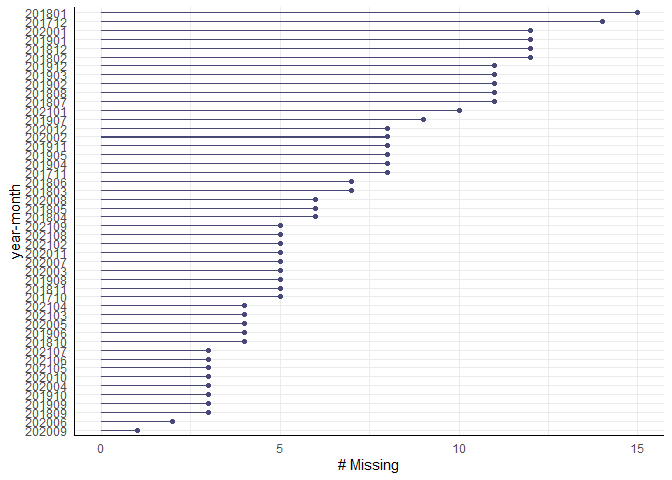
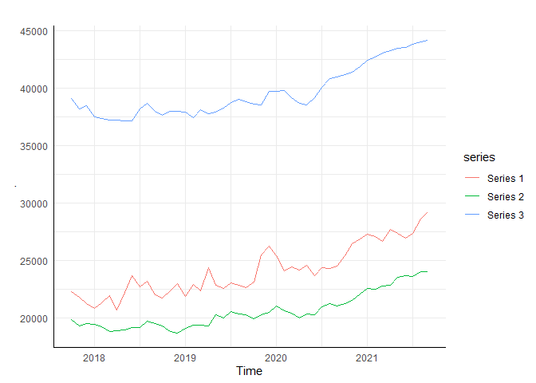
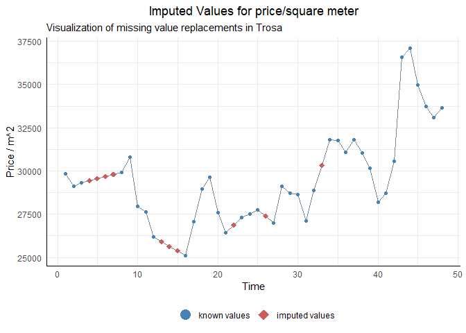

Covid-19 Pandemic & The Swedish Housing Market
================
<p align="center">
  
</p>

Benjamin Sivac
2022-05-04

## Introduction

Ever since covid-19 reached Sweden and regulations had been put in place, people have been speculating that the quarantine lifestyle is leading to a change in consumer preferences, where people find less value in “city-lifestyles” and are in a higher demand for houses and condominiums outside of the big cities where they get more bang for their buck, more space working from home (something that is being normalized), and a better environment compared to the old quarantine lifestyle.

The goal of this report is to investigate how the housing market has changed across different municipalities in the country. The main hypothesis is that the development of housing prices have changed after the pandemic started, and that sparsely populated areas have seen a more rapid increase in prices compared to the big cities.

By constructing forecast models, it’ll help to confirm whether or not the pandemic has had an impact on the housing market, but also to compare the forecasted price values to the actual price values past March 2020. Other than viewing plots to establish if the prices have in fact become more equal, there will be an attempt to utilize and compare the rate between disposable income to the prices as a measurable variable.

## Preparing the Environment

Importing the required packages for performing data manipulation, visualization, imputation and analyzing time series.

``` r
library(imputeTS)
library(missForest)
library(tidyverse)
library(ggfortify) #ggplot2 extensions
library(janitor) # row to names
library(readxl)
library(ggcorrplot)
library(magrittr) # set_rownames
library(ggpubr) # ggarrange
library(naniar) # more viz for missing values (gg_miss)
library(psych) # descriptive stats. describe() function.
library(zoo) # as.yearmon
library(seasonal) # seas function SEATS
library(forecast) # checkresiduals..
library(aTSA) # kpss- and pp.test
```

## Assessing the Data

Following data was provided by Hans Flink at ‘Mäklarstatistik AB’, containing monthly prices of condominiums in all 290 Swedish municipalities from the past 4 years (2017-2021). The price of condominiums is measured in Price/m and is reported as the mean price in each respective municipality given in SEK. It also has an extra column, named ‘Type’, which we added as an group indicator based on a report made by ‘Swedish Agency for Growth Policy Analysis’ from 2014. It accounts for geographic location, area size, population size, travel distance to a large district, and the level of urbanization, making up three group categories: Rural municipalities, dense municipalities, and metropolitan municipalities, referred to as group 1, 2 and 3. With 290 municipalities in Sweden, it comes out to 130, 131 and 29 municipalities in each group respectively.

``` r
df.condos <- read_excel("Data_condos.xlsx", col_names = TRUE)
```

``` r
df.condos %>% head()
```

    ## # A tibble: 6 x 51
    ##      LK  Type Municipality `201710` `201711` `201712` `201801` `201802` `201803`
    ##   <dbl> <dbl> <chr>           <dbl>    <dbl>    <dbl>    <dbl>    <dbl>    <dbl>
    ## 1   114     3 Upplands-Vä~   35014.   34921.   34255.   32926.   32347.   32660.
    ## 2   115     2 Vallentuna     32528.   31183.   29797.   28988.   29699.   29253.
    ## 3   117     3 Österåker      34856.   35228.   35252.   33426.   31801.   31774.
    ## 4   120     2 Värmdö         42241.   41005.   41519.   40976.   41169.   40370.
    ## 5   123     3 Järfälla       36344.   36584.   37174.   37427.   36360.   36102.
    ## 6   125     2 Ekerö          38721.       0        0        0        0        0 
    ## # ... with 42 more variables: `201804` <dbl>, `201805` <dbl>, `201806` <dbl>,
    ## #   `201807` <dbl>, `201808` <dbl>, `201809` <dbl>, `201810` <dbl>,
    ## #   `201811` <dbl>, `201812` <dbl>, `201901` <dbl>, `201902` <dbl>,
    ## #   `201903` <dbl>, `201904` <dbl>, `201905` <dbl>, `201906` <dbl>,
    ## #   `201907` <dbl>, `201908` <dbl>, `201909` <dbl>, `201910` <dbl>,
    ## #   `201911` <dbl>, `201912` <dbl>, `202001` <dbl>, `202002` <dbl>,
    ## #   `202003` <dbl>, `202004` <dbl>, `202005` <dbl>, `202006` <dbl>, ...

The data is in a wide, somewhat messy format, having 48 columns for each month showing the average Price/m of condominiums as values. It is probably easier to understand viewing it in a long format:

``` r
df.condos %>% pivot_longer('201710':'202109', names_to = "year_month", values_to = "price")
```

    ## # A tibble: 13,920 x 5
    ##       LK  Type Municipality   year_month  price
    ##    <dbl> <dbl> <chr>          <chr>       <dbl>
    ##  1   114     3 Upplands-Väsby 201710     35014.
    ##  2   114     3 Upplands-Väsby 201711     34921.
    ##  3   114     3 Upplands-Väsby 201712     34255.
    ##  4   114     3 Upplands-Väsby 201801     32926.
    ##  5   114     3 Upplands-Väsby 201802     32347.
    ##  6   114     3 Upplands-Väsby 201803     32660.
    ##  7   114     3 Upplands-Väsby 201804     32935.
    ##  8   114     3 Upplands-Väsby 201805     32891.
    ##  9   114     3 Upplands-Väsby 201806     32105.
    ## 10   114     3 Upplands-Väsby 201807     32522.
    ## # ... with 13,910 more rows

Other than the previous mentioned data and the obvious columns, LK are reference numbers for each municipality in Sweden. There are values of zero seen in the wide format output, presumed to be NA values caused by agencies not reporting their numbers of that month which needs to be corrected before starting any time series analysis.

Converting both 0’s to NA’s and subsetting the wide data with only the monthly prices:

``` r
df.condos[df.condos == 0] <- NA
df.sub <- df.condos %>% dplyr::select(-c(1,2,3))
```

Verify how many cells there are, how many are missing, and the percentage missing.

``` r
(totalcells = prod(dim(df.sub))) # calculating the product of dimensions of dataframe 
```

    ## [1] 13920

``` r
(missingcells = sum(is.na(df.sub))) # calculating the number of cells with na
```

    ## [1] 7733

``` r
(percentage = (missingcells * 100 )/(totalcells)) # calculating percentage of missing values
```

    ## [1] 55.55316

There are a ton of missing values seen in the output. Visualizing all of them, or even by group type, would be overwhelming and a visual clutter. But visualizing one municipality might be enough to reveal more patterns.

``` r
ggplot_na_distribution(
  t(df.sub)[,6],
  x_axis_labels = NULL,
  color_points = "steelblue",
  color_lines = "steelblue2",
  color_missing = "indianred",
  color_missing_border = "indianred",
  alpha_missing = 0.5,
  title = "Distribution of Missing Values",
  subtitle = "Time Series with highlighted missing regions",
  xlab = "Time",
  ylab = "Value",
  shape_points = 20,
  size_points = 2.5,
  theme_minimal() + 
  theme(axis.line = element_line(colour = "black"),
        plot.title = element_text(hjust = 0.5))
)
```


It exhibits large gaps of missing values, likely because there are no house broker reporting their numbers. Having that many missing values will be an issue for performing time series analysis and modeling. It will therefore be a requirement to either remove them, fill them with reasonable numbers, or both.

## Missing Data Imputation

Since there are municipalities with close to 100% missing values, performing listwise deletion is probably in order. However, a complete listwise deletion would waste data and compromise the accuracy and unbiasedness of it. Instead, a partial-list wise deletion would be less extreme and acceptable by just removing municipalities over a certain threshold. In this case, 50% or higher seems reasonable.

``` r
# Semi-listwise deletion 50%
delete.na <- function(BF, n=0) { # delete too many NA function
  BF[rowSums(is.na(BF)) <= n,]
}
(df.condos_partial <- df.condos %>% delete.na(24)) # no more than 24 missing values per municipality
```

    ## # A tibble: 129 x 51
    ##       LK  Type Municipality   `201710` `201711` `201712` `201801` `201802`
    ##    <dbl> <dbl> <chr>             <dbl>    <dbl>    <dbl>    <dbl>    <dbl>
    ##  1   114     3 Upplands-Väsby   35014.   34921.   34255.   32926.   32347.
    ##  2   115     2 Vallentuna       32528.   31183.   29797.   28988.   29699.
    ##  3   117     3 Österåker        34856.   35228.   35252.   33426.   31801.
    ##  4   120     2 Värmdö           42241.   41005.   41519.   40976.   41169.
    ##  5   123     3 Järfälla         36344.   36584.   37174.   37427.   36360.
    ##  6   125     2 Ekerö            38721.      NA       NA       NA       NA 
    ##  7   126     3 Huddinge         38496.   38820.   38103.   38407.   37902.
    ##  8   127     3 Botkyrka         33496.   33386.   32254.   31003.   30460.
    ##  9   128     3 Salem            30749.   30602.   30130.   28833.   28206.
    ## 10   136     3 Haninge          35606.   32872.   32195.   31156.   30713.
    ## # ... with 119 more rows, and 43 more variables: `201803` <dbl>,
    ## #   `201804` <dbl>, `201805` <dbl>, `201806` <dbl>, `201807` <dbl>,
    ## #   `201808` <dbl>, `201809` <dbl>, `201810` <dbl>, `201811` <dbl>,
    ## #   `201812` <dbl>, `201901` <dbl>, `201902` <dbl>, `201903` <dbl>,
    ## #   `201904` <dbl>, `201905` <dbl>, `201906` <dbl>, `201907` <dbl>,
    ## #   `201908` <dbl>, `201909` <dbl>, `201910` <dbl>, `201911` <dbl>,
    ## #   `201912` <dbl>, `202001` <dbl>, `202002` <dbl>, `202003` <dbl>, ...

The remaining data consists of 129 municipalities with some missing values still remaining.

``` r
(totalcells = prod(dim(df.condos_partial[,4:51]))) # calculating the product of dimensions of dataframe 
```

    ## [1] 6192

``` r
(missingcells = sum(is.na(df.condos_partial[,4:51]))) # calculating the number of cells with na
```

    ## [1] 323

``` r
(percentage = (missingcells * 100 )/(totalcells)) # calculating percentage of missing values
```

    ## [1] 5.216408

``` r
df.condos_partial %>% 
  dplyr::select(-c(1, 2, 3)) %>% 
  gg_miss_var() + 
  labs(x = "year-month") +
  theme_minimal() + 
  theme(axis.line = element_line(colour = "black"),
        plot.title = element_text(hjust = 0.5))# remove useless columns
```


There is 5% missing values in the remaining 129 municipalities. A quick glance at number of missing values per month shows that older time stamps have higher number of gaps in the data which, again, is likely because house brokers in remote and small areas had yet to enter the agency/association.

To decide on an imputation method for the remaining 5%, observing any general trends in the remaining data is advisable, mainly by plotting average price for each group instead of assessing each municipality one-by-one.

``` r
df.sub <- df.condos_partial %>% dplyr::select(-c(3)) # Also remove useless columns (for now)

df.sub %>% group_by(Type) %>% dplyr::select(-LK) %>% 
  summarise(across(everything(), mean, na.rm=TRUE)) %>% 
  dplyr::select(-Type) %>% 
  t() %>% 
  ts(frequency = 12, start = c(2017,10)) %>% 
  autoplot() +
  theme_minimal() + 
  theme(axis.line = element_line(colour = "black"),
        plot.title = element_text(hjust = 0.5))
```



It is difficult to generalise a common trend and seasonal pattern across all municipalities. Smaller municipalities naturally have fewer monthly sales with less volatility than the bigger ones, and while there is a clear seasonality for the group averages, there are individual municipalities that experience opposite patterns. One common trait seems to exist amongst all municipalities; they all experience the same upward trend. In relation to a strong presence of trend, the seasonal component for each group could arguably be perceived as rather weak.

Using static imputation methods, e.g. mean value imputation, would cause any pattern or relationship to be disturbed or be lost. While regression imputation avoids significant alteration of the standard deviation or the shape of the distribution, the housing market is highly correlated between municipalities which would inevitably generate a design matrix that is not invertible and prove difficult to fit a regression model. Selecting either cold- or hot deck imputation methods would likely not deliver good results as there is a common presence of large consecutive gaps in the data, a result of said inconsistent documentation of data.

Linear interpolation is a likely candidate, as it is a fitting univariate method for data with high trend and low seasonality. Evaluation will be done by measuring the value of NRMSE, despite being known for judging uncertainty rather poorly and providing too many false positives. But imputation isn’t the main focus of this report and different methods wont likely make a huge difference.

Next up is to remove every municipality that has any missing value, leaving 97 municipalities remaining. Also transposing it and keeping it as a data frame.

``` r
delete.na <- function(BF, n=0) { # delete too many NA function
  BF[rowSums(is.na(BF)) <= n,]
}
df.noNA <- df.sub %>% delete.na(0) # 97 municipalities left remaining

df.noNA <- df.noNA %>% 
  set_rownames(.$LK) %>% 
  dplyr::select(-c(LK, "Type")) %>% 
  as.data.frame() %>% 
  t()# Change row numbers to LK numbers, and remove LK column
```

Following action is to resemble the original data by creating a training data set with 5% missing values.

``` r
df_mis <- prodNA(df.noNA, noNA = 0.05) # create 5% missing values (same level as our original data)
train <- na_seadec(df_mis, algorithm = "interpolation", find_frequency=TRUE)
mixError(train, df_mis, df.noNA) # ~4% error
```

    ## NRMSE 
    ##    NA

The second function has a built-in argument for detecting the frequency of each univariate model and also removes the trend- and seasonal components before performing linear interpolation. Note there were warning messages for \~50 or so municipalities where the function could not determine a frequency, corroborating weak seasonal patterns. It subsequently brings back the components onto the series and compares with the original values, resulting in a NRMSE value of \~5%.

Imputing the actual data set.

``` r
#TRANSPOSE
stored_columns <- df.condos_partial[,1:3] # store LK numbers
df.ch <- df.condos_partial %>% dplyr::select(-c(1, 2, 3)) # remove useless columns
df.ch <- as.data.frame(t(df.ch))

#Imputation
df.imp <- na_seadec(df.ch, algorithm = "interpolation", find_frequency=TRUE)

# Convert to time series object
ts.ch <- ts(df.ch, frequency = 12, start = c(2017,10))
ts.imp <- ts(df.imp, frequency = 12, start = c(2017,10))

#Plot
ggplot_na_imputations(
  ts.ch[,37],
  ts.imp[,37],
  title = "Imputed Values for price/square meter",
  subtitle = "Visualization of missing value replacements in Trosa",
  xlab = "Time",
  ylab = "Price / m^2",
  color_points = "steelblue",
  color_imputations = "indianred",
  color_truth = "seagreen3",
  color_lines = "lightslategray",
  shape_points = 16,
  shape_imputations = 18,
  shape_truth = 16,
  size_points = 1.5,
  size_imputations = 2.5,
  size_truth = 1.5,
  size_lines = 0.5,
  linetype = "solid",
  connect_na = TRUE,
  legend = TRUE,
  legend_size = 5,
  label_known = "known values",
  label_imputations = "imputed values",
  label_truth = "ground truth",
  theme = theme_minimal() + 
  theme(axis.line = element_line(colour = "black"),
        plot.title = element_text(hjust = 0.5))
)
```



The imputed values for longer gaps are evidently constant with no variance, but since the major part of the information lies within the trend, it’ll suffice.

## Choosing a time series model
*[To be continued]*
