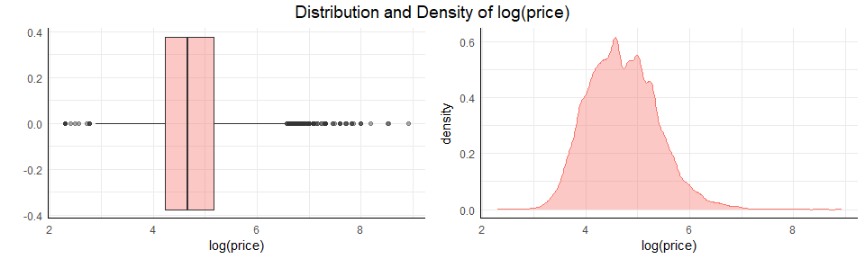
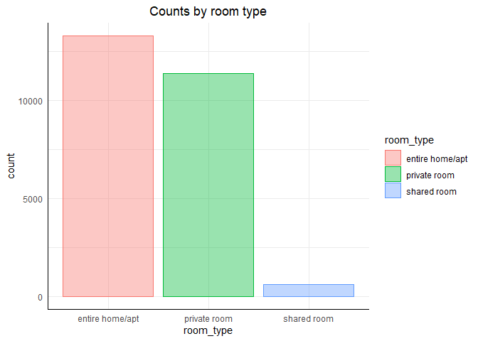
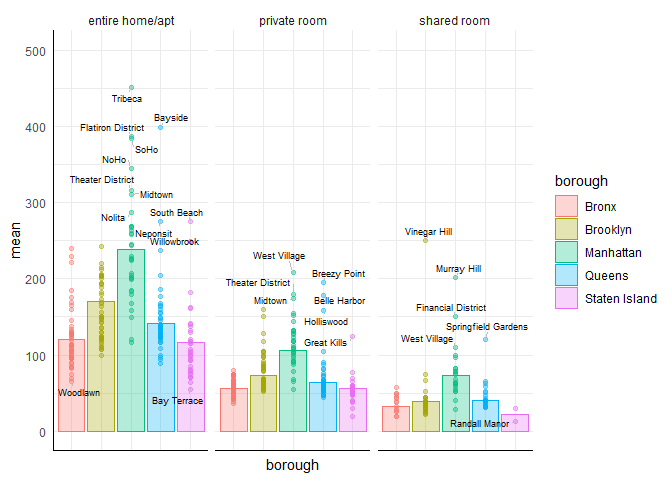

Airbnb listings in New York City
================
<p align="center">
  
</p>

Benjamin Sivac
2022-04-19

## Introduction

Welcome to New York City, one of the most-visited cities in the world. As a result, there are many Airbnb listings in New York City to meet the high demand for temporary lodging for anywhere between a few nights to many months. In this notebook, we will take a closer look at the New York Airbnb market by combining data from multiple file types.

You are a consultant working for a real estate start-up and have been asked to look into the short-term rental market in New York, so you’ve gathered Airbnb listing data from several different sources. You’ll examine this data to answer any questions, but you’ll need to combine the different files from your three sources into one dataset and clean it in order to calculate the metrics you’re interested in.

## Datasets

**datasets/airbnb\_price.csv**

This is a CSV file containing data on the prices and neighborhoods of Airbnbs.

-   listing\_id: unique identifier of listing
-   price: nightly listing price in USD
-   nbhood\_full: name of borough and neighborhood where listing is located

**datasets/airbnb\_room\_type.xlsx**

This is an Excel file containing data on Airbnb listing descriptions and room types.

-   listing\_id: unique identifier of listing
-   description: listing description
-   room\_type: Airbnb has three types of rooms: shared rooms, private rooms, and entire homes/apartments

**datasets/airbnb\_last\_review.tsv**

This is a TSV file containing data on Airbnb host names and review dates.

-   listing\_id: unique identifier of listing
-   host\_name: name of listing host
-   last\_review: date when the listing was last reviewed

## Preparing the Environment

Importing the required packages for importing data, performing data manipulation, and creating visualizations.

``` r
library(tidyverse)
library(readxl)
library(lubridate)
library(ggrepel) # add labels to each neighborhood point
library(ggpubr) # ggarrange()
```

### Import data

``` r
df.prices %>% glimpse()
```

    ## Rows: 25,209
    ## Columns: 3
    ## $ listing_id  <int> 2595, 3831, 5099, 5178, 5238, 5295, 5441, 5803, 6021, 6848~
    ## $ price       <chr> "225 dollars", "89 dollars", "200 dollars", "79 dollars", ~
    ## $ nbhood_full <chr> "Manhattan, Midtown", "Brooklyn, Clinton Hill", "Manhattan~

``` r
df.room_type %>% glimpse()
```

    ## Rows: 25,209
    ## Columns: 3
    ## $ listing_id  <dbl> 2595, 3831, 5099, 5178, 5238, 5295, 5441, 5803, 6021, 6848~
    ## $ description <chr> "Skylit Midtown Castle", "Cozy Entire Floor of Brownstone"~
    ## $ room_type   <chr> "Entire home/apt", "Entire home/apt", "Entire home/apt", "~

``` r
df.last_review %>% glimpse()
```

    ## Rows: 25,209
    ## Columns: 3
    ## $ listing_id  <dbl> 2595, 3831, 5099, 5178, 5238, 5295, 5441, 5803, 6021, 6848~
    ## $ host_name   <chr> "Jennifer", "LisaRoxanne", "Chris", "Shunichi", "Ben", "Le~
    ## $ last_review <chr> "May 21 2019", "July 05 2019", "June 22 2019", "June 24 20~

They have the same number of rows and the same key identifier, listing\_id, for joining them together into one single dataset.

``` r
df.data <- df.prices %>% full_join(df.last_review, by="listing_id") %>% 
  full_join(df.room_type, by = "listing_id") # joining all three datasets together

df.data %>% glimpse()
```

    ## Rows: 25,209
    ## Columns: 7
    ## $ listing_id  <dbl> 2595, 3831, 5099, 5178, 5238, 5295, 5441, 5803, 6021, 6848~
    ## $ price       <chr> "225 dollars", "89 dollars", "200 dollars", "79 dollars", ~
    ## $ nbhood_full <chr> "Manhattan, Midtown", "Brooklyn, Clinton Hill", "Manhattan~
    ## $ host_name   <chr> "Jennifer", "LisaRoxanne", "Chris", "Shunichi", "Ben", "Le~
    ## $ last_review <chr> "May 21 2019", "July 05 2019", "June 22 2019", "June 24 20~
    ## $ description <chr> "Skylit Midtown Castle", "Cozy Entire Floor of Brownstone"~
    ## $ room_type   <chr> "Entire home/apt", "Entire home/apt", "Entire home/apt", "~

We need to clean up the data before exploring and answering any questions.

## Data wrangling

There are a few columns to fix; there’s no need to have “dollars” in each and every cell of the price column, and it needs to be converted from string to numeric type. The last\_review column needs to be converted to a date type, and nbhood\_full would look better by splitting it up into borough and neighborhood.

``` r
df.data <- df.data %>% mutate(price = str_remove(price, " dollars"), price = as.numeric(price)) # remove dollars and convert to numeric
df.data <- df.data %>% mutate(last_review = mdy(last_review)) # Convert to date type
df.data <- df.data %>% separate(nbhood_full, c("borough", "neighborhood"), sep=", ") # seoerate nbhood_full into two different columns
df.data %>% glimpse()
```

    ## Rows: 25,209
    ## Columns: 8
    ## $ listing_id   <dbl> 2595, 3831, 5099, 5178, 5238, 5295, 5441, 5803, 6021, 684~
    ## $ price        <dbl> 225, 89, 200, 79, 150, 135, 85, 89, 85, 140, 215, 140, 99~
    ## $ borough      <chr> "Manhattan", "Brooklyn", "Manhattan", "Manhattan", "Manha~
    ## $ neighborhood <chr> "Midtown", "Clinton Hill", "Murray Hill", "Hell's Kitchen~
    ## $ host_name    <chr> "Jennifer", "LisaRoxanne", "Chris", "Shunichi", "Ben", "L~
    ## $ last_review  <date> 2019-05-21, 2019-07-05, 2019-06-22, 2019-06-24, 2019-06-~
    ## $ description  <chr> "Skylit Midtown Castle", "Cozy Entire Floor of Brownstone~
    ## $ room_type    <chr> "Entire home/apt", "Entire home/apt", "Entire home/apt", ~

Everything looks good now except for room\_type which seems to have random capitalization. We’ll check how many unique values it has.

``` r
unique(df.data$room_type) # We find 8 different unique values
```

    ## [1] "Entire home/apt" "private room"    "Private room"    "entire home/apt"
    ## [5] "PRIVATE ROOM"    "shared room"     "ENTIRE HOME/APT" "Shared room"    
    ## [9] "SHARED ROOM"

``` r
df.data <- df.data %>% mutate(room_type = tolower(room_type), room_type = as.factor(room_type)) # convert to lower case.
unique(df.data$room_type) # Now it looks good !
```

    ## [1] entire home/apt private room    shared room    
    ## Levels: entire home/apt private room shared room

``` r
df.data %>% glimpse()
```

    ## Rows: 25,209
    ## Columns: 8
    ## $ listing_id   <dbl> 2595, 3831, 5099, 5178, 5238, 5295, 5441, 5803, 6021, 684~
    ## $ price        <dbl> 225, 89, 200, 79, 150, 135, 85, 89, 85, 140, 215, 140, 99~
    ## $ borough      <chr> "Manhattan", "Brooklyn", "Manhattan", "Manhattan", "Manha~
    ## $ neighborhood <chr> "Midtown", "Clinton Hill", "Murray Hill", "Hell's Kitchen~
    ## $ host_name    <chr> "Jennifer", "LisaRoxanne", "Chris", "Shunichi", "Ben", "L~
    ## $ last_review  <date> 2019-05-21, 2019-07-05, 2019-06-22, 2019-06-24, 2019-06-~
    ## $ description  <chr> "Skylit Midtown Castle", "Cozy Entire Floor of Brownstone~
    ## $ room_type    <fct> entire home/apt, entire home/apt, entire home/apt, privat~

It fell neatly into place by just converting each unique value to lower case. The data cleaning process is officially done!

## Exploration and Visualization

``` r
plot.box <- df.data %>% ggplot(aes(x=log(price), fill="blue")) +
  geom_boxplot(alpha=0.4, show.legend = FALSE) +
  theme_minimal() + 
  theme(axis.line = element_line(colour = "black"),
        plot.title = element_text(hjust = 0.5))
plot.density <- df.data %>% ggplot(aes(log(price), fill="blue", color="blue")) +
  geom_density(alpha=0.4, show.legend = FALSE) +
  theme_minimal() + 
  theme(axis.line = element_line(colour = "black"),
        plot.title = element_text(hjust = 0.5))
ggarrange(plot.box, plot.density,
          align = "hv") %>% 
  annotate_figure(top = text_grob("Distribution and Density of log(price)", size=14))
```
<p align="center">

</p>

The natural log of listing prices closely resembles a bell curve, albeit a bit skewed to the right which would suggest comparing median prices rather than mean.   Looking at the boxplot, there seems to be a number of free listings in the data, there are also a couple of extremely expensive ones. Out of curiosity, let’s have a closer look to see if these values are reasonable or widely inaccurate due to measurement errors.

``` r
df.data %>% group_by(borough, neighborhood, room_type) %>% 
  summarise(mean(price),
            max=max(price),
            min(price),
            sd(price),
            n()) %>% 
  arrange(desc(max))
```

    ## # A tibble: 490 x 8
    ## # Groups:   borough, neighborhood [217]
    ##    borough   neighborhood room_type `mean(price)`   max `min(price)` `sd(price)`
    ##    <chr>     <chr>        <fct>             <dbl> <dbl>        <dbl>       <dbl>
    ##  1 Brooklyn  East Flatbu~ private ~          104.  7500           27        557.
    ##  2 Manhattan Midtown      entire h~          311   5100           70        322.
    ##  3 Manhattan Harlem       entire h~          184.  5000           49        242.
    ##  4 Manhattan Upper West ~ entire h~          227.  3613           65        201.
    ##  5 Manhattan SoHo         entire h~          384.  3000           76        402.
    ##  6 Manhattan Chelsea      entire h~          268.  2995           60        216.
    ##  7 Manhattan Nolita       entire h~          288.  2990           89        342.
    ##  8 Queens    Bayside      entire h~          399.  2600           55        734.
    ##  9 Brooklyn  Crown Heigh~ entire h~          168.  2500           48        149.
    ## 10 Manhattan East Village entire h~          224.  2500           59        163.
    ## # ... with 480 more rows, and 1 more variable: `n()` <int>

``` r
df.data %>% filter(price=="7500")
```

    ##   listing_id price  borough  neighborhood host_name last_review
    ## 1   34895693  7500 Brooklyn East Flatbush    Sandra  2019-07-07
    ##            description    room_type
    ## 1 Gem of east Flatbush private room

Brooklyn East Flatbush do have a fair number of listings with reasonable stats, except for the maximum price listing. Looking at its description- “Gem of east Flatbush”, it seems to be an intended, appropriate pricing. Let’s have a look at the free listings:

``` r
df.data %>% filter(price=="0")
```

    ##   listing_id price  borough       neighborhood    host_name last_review
    ## 1   20333471     0    Bronx    East Morrisania       Anisha  2019-06-24
    ## 2   20523843     0 Brooklyn           Bushwick Martial Loft  2019-05-18
    ## 3   20639628     0 Brooklyn Bedford-Stuyvesant      Adeyemi  2019-06-15
    ## 4   20639792     0 Brooklyn Bedford-Stuyvesant      Adeyemi  2019-06-21
    ## 5   20639914     0 Brooklyn Bedford-Stuyvesant      Adeyemi  2019-06-23
    ## 6   21291569     0 Brooklyn           Bushwick       Sergii  2019-06-22
    ## 7   21304320     0 Brooklyn           Bushwick       Sergii  2019-05-24
    ##                                          description    room_type
    ## 1  ‚òÖHostel Style Room | Ideal Traveling Buddies‚òÖ private room
    ## 2    MARTIAL LOFT 3: REDEMPTION (upstairs, 2nd room) private room
    ## 3 Spacious comfortable master bedroom with nice view private room
    ## 4  Contemporary bedroom in brownstone with nice view private room
    ## 5       Cozy yet spacious private brownstone bedroom private room
    ## 6  Coliving in Brooklyn! Modern design / Shared room  shared room
    ## 7             Best Coliving space ever! Shared room.  shared room

5 private rooms and 2 shared rooms in Brooklyn and Bronx with very appealing descriptions. They probably just forgot to list a price value.

Let’s explore the listing prices by different groups and subgroups. First we’ll check the amount of listings by type of room, doing so will give us an idea of the distribution of listings and validate any following comparisons between them.

``` r
df.data %>% group_by(room_type) %>% 
  ggplot(aes(x=room_type, fill=room_type, color=room_type)) + 
  geom_bar(alpha=0.4) +
  labs(title="Counts by room type") +
  theme_minimal() + 
  theme(axis.line = element_line(colour = "black"),
        plot.title = element_text(hjust = 0.5))
```
<p align="center">

</p>

There are close to no listings for shared rooms, but both apartments/houses and private rooms have over 10000 listings.

``` r
stat.groups <- df.data %>% group_by(borough, room_type) %>% 
  summarise(mean=mean(price))

stat.count <- df.data %>% group_by(borough, neighborhood, room_type) %>% 
  summarise(mean=mean(price),
            count=n())
stat.count %>% ggplot(aes(y=mean, x=borough, fill=borough, color=borough)) +
  geom_point(stat="identity", alpha=0.4, show.legend = FALSE) +
  geom_bar(data=stat.groups, stat="identity", alpha=0.3) +
  ylim(0,500) +
  geom_text_repel(data=stat.count %>% filter(dense_rank(-count) < 6), 
                  aes(label = neighborhood), 
                  color = "black",
                  size = 2.5, 
                  segment.color = "grey",
                  min.segment.length = 0) +
  theme_minimal() + 
  theme(axis.line = element_line(colour = "black"),
        plot.title = element_text(hjust = 0.5),
        axis.text.x = element_blank()) +
  facet_wrap(~room_type)
```
<p align="center">

</p>
We can with point and box plots combined observe the distribution of prices across boroughs and type of rooms that are listed. It also shows labels for the most commonly listed neighborhoods by each borough. Homes and apartments are close to being twice as expensive as private rooms, and probably three times as expensive than shared rooms. Manhattan is clearly the most expensive across each housing type with the average listing price being 240 dollars per night for entire homes and apartments, about 105 dollars for private rooms, and 75 dollars for shared rooms. It seems to also have the biggest range, with Queens and Staten Island showing similar distributions. Staten Island and Bronx are both very close to being the cheapest amongst the 5 boroughs. Having never been to NYC and never heard of Bronx or Staten Island, it seems reasonable that they are the two cheapest ones and that the other three have higher standards of living and are therefore higher priced.
