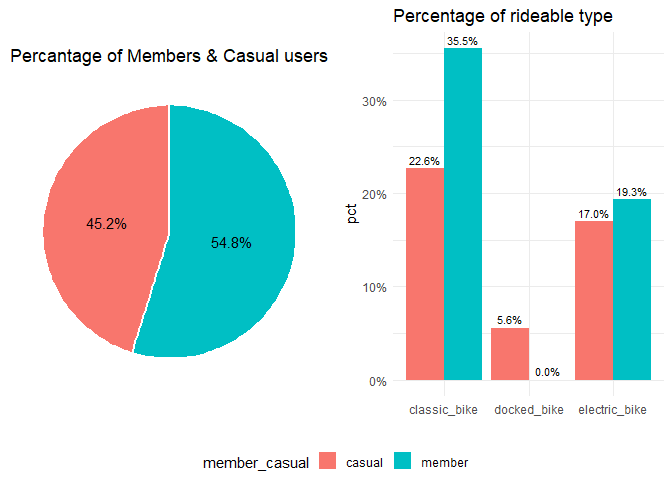
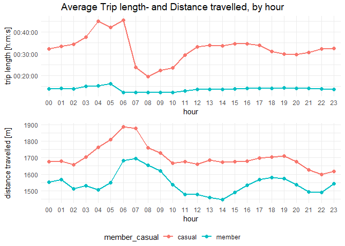

Cyclistic Case Study
================
Benjamin Sivac
2022-03-20

### Preamble

This report is to show my approach and work in solving a case study
provided by Google Data Analytics Course. While there are uses for SQL
and Tableau in this report, I’ll leave those for future case studies and
instead only focus on R and Rmarkdown. This will be a good opportunity
to get accustomed with the tidyverse package while also describing my
thought process with proper reasoning, comments and visualizations.

### Background

Cyclistic is a bike-share program that features more than 5,800 bicycles
and 600 docking stations. Cyclistic sets itself apart by also offering
reclining bikes, hand tricycles, and cargo bikes, making bike-share more
inclusive to people with disabilities and riders who can’t use a
standard two-wheeled bike. The majority of riders opt for traditional
bikes; about 8% of riders use the assistive options. Cyclistic users are
more likely to ride for leisure, but about 30% use them to commute to
work each day.

There are three different pricing plans: single-ride passes, full-day
passes, and annual memberships. Customers who purchase single-ride or
full-day passes are referred to as casual riders. Customers who purchase
annual memberships are Cyclistic members. **Aid the marketing team in
converting casual bike riders into annual members, by profiling each
group and giving recommendations.**

### Preparations

This report uses a fictional, publicly available dataset on bike trips
in Chicago. The data was accessed on March the 1st 2022, by the
following link <https://divvy-tripdata.s3.amazonaws.com/index.html>.

Loading packages suitable for manipulation of data, time and
coordinates, as well as useful packages for observing the data.

``` r
library(tidyverse) # tidy data & piping
library(lubridate) # 
library(geosphere)
library(ggpubr)
```

Starting off, the files are found too big and bothersome to load through
excel.

``` r
files <- list.files("biketrip_datafiles", full.names = TRUE)
paste(sum(file.size(files)),"bytes")
```

    ## [1] "1043882522 bytes"

The files together are above 1GB, making it slow and tedious to clean
and manipulate through excel or google sheets. It’s a big reason for
utilizing R instead of spreadsheets. The data is contained within
monthly data frames having same number of columns and same respective
data type. As such, concatenating the csv files can be done through the
following code.

``` r
# applies read_csv to every element and returns a list, binding together the rows into 1.
df_trips <- files %>% 
  lapply(read_csv) %>% 
  bind_rows 
```

Getting an overview of the data.

``` r
df_trips %>% glimpse()
```

    ## Rows: 5,595,063
    ## Columns: 13
    ## $ ride_id            <chr> "E19E6F1B8D4C42ED", "DC88F20C2C55F27F", "EC45C94683~
    ## $ rideable_type      <chr> "electric_bike", "electric_bike", "electric_bike", ~
    ## $ started_at         <dttm> 2021-01-23 16:14:19, 2021-01-27 18:43:08, 2021-01-~
    ## $ ended_at           <dttm> 2021-01-23 16:24:44, 2021-01-27 18:47:12, 2021-01-~
    ## $ start_station_name <chr> "California Ave & Cortez St", "California Ave & Cor~
    ## $ start_station_id   <chr> "17660", "17660", "17660", "17660", "17660", "17660~
    ## $ end_station_name   <chr> NA, NA, NA, NA, NA, NA, NA, NA, NA, "Wood St & Augu~
    ## $ end_station_id     <chr> NA, NA, NA, NA, NA, NA, NA, NA, NA, "657", "13258",~
    ## $ start_lat          <dbl> 41.90034, 41.90033, 41.90031, 41.90040, 41.90033, 4~
    ## $ start_lng          <dbl> -87.69674, -87.69671, -87.69664, -87.69666, -87.696~
    ## $ end_lat            <dbl> 41.89000, 41.90000, 41.90000, 41.92000, 41.90000, 4~
    ## $ end_lng            <dbl> -87.72000, -87.69000, -87.70000, -87.69000, -87.700~
    ## $ member_casual      <chr> "member", "member", "member", "member", "casual", "~

There are over 5.6 million observations for 13 columns. Each variable
seems to be stored in reasonable data types nor are there any
unnecessary white spaces or irregular names in need of trimming.
Manipulating and wrangling the data, with the stakeholders in mind,
enables it to be used and analysed. Therefore, checking for missing
values and duplicates is in order.

``` r
sum(duplicated(df_trips$ride_id))
```

    ## [1] 0

``` r
sapply(df_trips, function(y) sum(is.na(y))) # https://stackoverflow.com/a/31145812
```

    ##            ride_id      rideable_type         started_at           ended_at 
    ##                  0                  0                  0                  0 
    ## start_station_name   start_station_id   end_station_name     end_station_id 
    ##             690809             690806             739170             739170 
    ##          start_lat          start_lng            end_lat            end_lng 
    ##                  0                  0               4771               4771 
    ##      member_casual 
    ##                  0

There are no duplicates present in the data frame, but station names and
ID’s do have equal number of missing values which is redundant as they
share the same information. ID’s will consequently be dropped from the
data, leaving 11 remaining variables in the data frame.

``` r
df_trips <- df_trips %>% dplyr::select(-start_station_id, -end_station_id)
```

### Data Wrangling

Again, the purpose of this report is to find meaningful insights by
profiling different customers and informing the marketing team of said
new insights. It may pertain to customer preferences, marketing efforts,
ad placements etc. Hence there is a need to transform parts of the data
to make it more suitable for analysis.

#### Trip length

Since the gathered timestamps consist of both start and end times of
each trip, calculating the trip length is possible by either subtracting
one column by another, or for fun try out an overly complicated function
and change the data type three times over.

``` r
# gather time difference, convert to seconds and then to hour-minutes-seconds format.
df_trips$trip_length <- df_trips %>% with(hms::hms(seconds_to_period(difftime(ended_at,started_at,units = "secs"))))
df_trips$trip_length %>%  sample(5)
```

    ## 00:17:38
    ## 00:27:01
    ## 00:08:32
    ## 00:02:06
    ## 00:03:25

``` r
df_trips$trip_length %>% min()
```

    ## Time difference of -3482 secs

There are negative values that will be kept but filtered out for later
analysis. By doing so, there wont be a loss off valuable observations
for other variables, like rideable type.

#### Distance travelled

Following code is an attempt at trying to make use of the recorded spatial coordinates of each observation. 
It will likely be inaccurate, as Haversine formula calculates the
great-circle distance between two coordinates with no regards to
different routes, while also returning values of zero for people
returning to the same starting station. But it may still give an idea of
any differences between types of riders as there are close to 5.5
million observations.

``` r
df_trips <- df_trips %>% mutate(distance_travelled = distHaversine(cbind(start_lat, start_lng), cbind(end_lat, end_lng)))
df_trips$distance_travelled <- df_trips$distance_travelled %>% round(digits=2)
sample(df_trips$distance_travelled, 5)
```

    ## [1]    0.00 1895.71    9.09  423.89 1008.47

#### Time variables

Divvying up the date-time column may reveal any possible trends in
traffic, both by season, weekdays, and hour of day. To do so, assigning
values to each month and weekday helps to plot the values in order along
the x-axis.

``` r
df_trips$month <- df_trips$started_at %>% strftime('%B')
df_trips$month <- ordered(df_trips$month, levels=c("January", "February", "March", "April", 
"May", "June", "July", "August", "September", "October", "November", "December"))
sample(df_trips$month,5)
```

    ## [1] November July     October  May      July    
    ## 12 Levels: January < February < March < April < May < June < ... < December

``` r
df_trips$weekday <- df_trips$started_at %>% strftime('%A')
df_trips$weekday <- ordered(df_trips$weekday, levels=c("Monday", "Tuesday", "Wednesday", "Thursday", 
"Friday", "Saturday", "Sunday"))
sample(df_trips$weekday,5)
```

    ## [1] Sunday   Saturday Tuesday  Sunday   Friday  
    ## 7 Levels: Monday < Tuesday < Wednesday < Thursday < Friday < ... < Sunday

``` r
df_trips$hour <- df_trips$started_at %>% strftime('%H')
sample(df_trips$hour,5)
```

    ## [1] "15" "01" "14" "21" "17"

#### Data overview

One final look before proceeding with the analysis.

``` r
df_trips %>%
  glimpse()
```

    ## Rows: 5,595,063
    ## Columns: 16
    ## $ ride_id            <chr> "E19E6F1B8D4C42ED", "DC88F20C2C55F27F", "EC45C94683~
    ## $ rideable_type      <chr> "electric_bike", "electric_bike", "electric_bike", ~
    ## $ started_at         <dttm> 2021-01-23 16:14:19, 2021-01-27 18:43:08, 2021-01-~
    ## $ ended_at           <dttm> 2021-01-23 16:24:44, 2021-01-27 18:47:12, 2021-01-~
    ## $ start_station_name <chr> "California Ave & Cortez St", "California Ave & Cor~
    ## $ end_station_name   <chr> NA, NA, NA, NA, NA, NA, NA, NA, NA, "Wood St & Augu~
    ## $ start_lat          <dbl> 41.90034, 41.90033, 41.90031, 41.90040, 41.90033, 4~
    ## $ start_lng          <dbl> -87.69674, -87.69671, -87.69664, -87.69666, -87.696~
    ## $ end_lat            <dbl> 41.89000, 41.90000, 41.90000, 41.92000, 41.90000, 4~
    ## $ end_lng            <dbl> -87.72000, -87.69000, -87.70000, -87.69000, -87.700~
    ## $ member_casual      <chr> "member", "member", "member", "member", "casual", "~
    ## $ trip_length        <time> 00:10:25, 00:04:04, 00:01:20, 00:11:42, 00:00:43, ~
    ## $ distance_travelled <dbl> 2589.37, 746.62, 373.74, 746.81, 367.67, 1484.10, 1~
    ## $ month              <ord> January, January, January, January, January, Januar~
    ## $ weekday            <ord> Saturday, Wednesday, Thursday, Thursday, Saturday, ~
    ## $ hour               <chr> "17", "19", "23", "14", "03", "15", "06", "16", "10~

Now there are 16 variables to work with, each to be applied and explored
for the benefit of the marketing team. Note again that distance traveled
is highly inaccurate but making use of every piece of data could be
considered good practice. It might also make a good reference for future
cases.

### Analysis

With the data cleaned, adjusted and prepared the analysis can finally begin.
It will cover ratios, time series, and frequencies for gaining insights
into customer profiles. This would help adjust marketing efforts,
improve engagement, and better promote Cyclistic with the casual user
base.

``` r
plot_prop <- df_trips %>% 
  count(member_casual) %>% 
  mutate(pct=prop.table(n)) %>%
  ggplot(aes("", pct, fill = member_casual)) + 
  geom_bar(width = 1, size = 1, color = "white", stat = "identity") +
  coord_polar("y") +
  geom_text(aes(label = scales::percent(pct)),
            position = position_stack(vjust = 0.5)) +
  theme_minimal() +
  theme(axis.line = element_blank(),
          axis.text = element_blank(),
          axis.ticks = element_blank(),
          panel.grid  = element_blank(),
          legend.position = "bottom") +
  labs(x = NULL, y = NULL, title="Percantage of Members & Casual users")

plot_bikes <- df_trips %>% count(member_casual, rideable_type) %>% 
  mutate(pct=prop.table(n)) %>% 
  ggplot(aes(rideable_type, pct, fill = member_casual, 
             label = scales::percent(pct))) + 
  geom_col(position="dodge") +
  scale_y_continuous(labels = scales::percent) +
  geom_text(position = position_dodge(.9), 
            vjust = -0.5, 
            size = 3) +
  theme_minimal() +
  theme(legend.position = "bottom") +
  labs(title="Percentage of rideable type", x="", face = "bold", size=14)

ggarrange(plot_prop, plot_bikes, 
          ncol = 2, 
          common.legend = TRUE,
          legend="bottom")
```
<p align="center">

</p>
For an overview of the customer base, members account for 54.8% of total
rides taken during the 1-year period, while casual riders comprised the
remaining 45.2% of trips. There is clearly a strong incentive for
Cyclistic to convert casual riders into members, rather than attracting
new consumers. Besides the fact that classic bikes are the most popular
option for both groups, neither favor the docked bikes.

``` r
plot_month <- df_trips %>% ggplot(aes(month, color=member_casual, group = member_casual)) + 
  geom_line(stat='count', size = 1) +
  geom_point(stat='count', size = 2) +
  theme_minimal() +
  theme(axis.text.x = element_text(angle=45, hjust=1, size = 7.7),
        legend.position = "none")

plot_weekday <- df_trips %>% ggplot(aes(weekday, color=member_casual, group = member_casual)) + 
  geom_line(stat='count', size = 1) +
  geom_point(stat='count', size = 2) +
  theme_minimal() +
  theme(axis.text.x = element_text(angle=45, hjust=1, size = 7.7),
        legend.position = "none")

plot_hour <- df_trips %>% ggplot(aes(hour, color=member_casual, group = member_casual)) + 
  geom_line(stat='count', size = 1) +
  geom_point(stat='count', size = 2) +
  theme_minimal() +
  theme(axis.text.x = element_text(angle=45, hjust=1, size = 7.7),
        legend.position = "none")
  
legend <- df_trips %>% ggplot(aes(month, color=member_casual, group = member_casual)) + 
  geom_line(stat='count', size = 1) +
  geom_point(stat='count', size = 2) +
  theme_minimal()
plot_legend <- get_legend(legend)

ggarrange(plot_month, plot_weekday, plot_hour, plot_legend, 
         align="hv") %>%
  annotate_figure(top = text_grob("Trips across 12 months", size=14))
```
<p align="center">

</p>
In terms of monthly trips, number of casual users peak in July and hit a
bottom in February, a clear relationship to weather conditions and
vacation times. Members do share similar numbers but, perhaps not
unexpectedly, do have a flatter slope towards the end of the year since
they are more likely to brave the cold later into the year than what
casual riders would.

In the line chart for weekdays, members are shown to have consistently
high numbers throughout work days but experience dip during the
weekends. Again in line with behaviour of workers. Even clearer when
comparing to casual riders showing considerably smaller numbers during
weekdays but peaking on the weekends.

Looking at traffic by hour of the day, members show clear spikes during
rush hours while casual users have overall lower numbers throughout the
days. This is probably because it only accounts for starting hours and
not following hours within one trip, and casual riders make up a smaller
portion against members. The plot might have told a different story if
it accounted for trip length, with casual riders likely taking longer
trips.

All three plots clearly reflects their status as casual riders and
members, the first group rides for leisure and the latter rides for
commuting.

``` r
plot_duration <- df_trips %>% filter(trip_length > 0) %>% 
  ggplot(aes(hour, trip_length, color=member_casual, group = member_casual)) + 
  stat_summary(fun = mean, geom = "line", size=1) +
  stat_summary(fun = mean, geom = "point", size=2) +# The stat_summary function removes all rows with null values.
  theme(axis.text.x = element_text(angle=45, hjust=1, size = 7.7)) +
  theme_minimal()
plot_distance <- df_trips %>% filter(distance_travelled > 0) %>% 
  ggplot(aes(hour, distance_travelled, group = member_casual, color = member_casual)) +
  stat_summary(fun = mean, geom = "line", size=1) +
  stat_summary(fun = mean, geom = "point", size=2) + # The stat_summary function removes all rows with null values.
  theme(axis.text.x = element_text(angle=45, hjust=1, size = 7.7)) +
  theme_minimal()

ggarrange(plot_duration, plot_distance, 
          common.legend = T, 
          legend = "bottom", 
          align = "hv", 
          ncol = 1) %>% 
  annotate_figure(top = text_grob("Average Trip length- and Distance travelled, by hour", 
                                  size=14))
```
<p align="center">

</p>
Casual users on average tend to bike for both longer periods of time and
longer distances, which is reasonable as workers would likely stick to a
few selected routes for making good on time. But also, casual users
would likely make stops and take sporadic routes for sightseeing. The
overall distance is rather short, suggesting that they do not bike for
sport or fitness.

Do note that the visualization does not account for consumers that have
presumably returned to the same starting station, since those are
filtered out to not drastically lower the average distance traveled.
Those who were filtered out amounts to

``` r
df_trips_distance_zero <- filter(df_trips, distance_travelled==0)
table(df_trips_distance_zero$member_casual)
```

    ## 
    ## casual member 
    ## 231117 144301

which is close to 10% of total observations.

``` r
df_trips %>% filter(trip_length > 0) %>%
  drop_na(start_station_name) %>% 
  add_count(start_station_name) %>%
  filter(dense_rank(-n) < 6) %>% 
  ggplot(aes(start_station_name, fill=member_casual, group = member_casual)) + 
  geom_bar(position=position_dodge()) +
  theme_minimal() +
  theme(axis.text.x = element_text(angle=45, hjust=1),
        plot.title = element_text(hjust = 0.5)) +
  labs(title="5 most common stations")
```
<p align="center">

</p>
‘Streeter Dr & Grand Ave’ and Millenium Park would be the best stations
for placing advertisement appealing to casual riders. Members have very
low numbers at Millennium Park, likely because it is not en route to any
workplaces.

``` r
df_trips %>% filter(trip_length > 0) %>%
  drop_na(start_station_name) %>% 
  add_count(start_station_name) %>%
  filter(dense_rank(-n) < 6) %>% 
  ggplot(aes(start_station_name, trip_length, fill=member_casual, group = member_casual)) + 
  stat_summary(fun = mean, geom = "bar", position=position_dodge()) +
  theme_minimal() +
  theme(axis.text.x = element_text(angle=45, hjust=1),
        plot.title = element_text(hjust = 0.5)) +
  labs(title="Trip length by 5 most common stations")
```
<p align="center">

</p>
Trip length by the 5 most common starting stations support the above
hypothesis, as casual riders would likely make stops and have extended
outings at Millennium Park.

``` r
df_trips %>% drop_na(start_station_name) %>% 
  group_by(member_casual) %>% 
  drop_na(start_station_name) %>%
  drop_na(end_station_name) %>% 
  count(paste(start_station_name," - ", end_station_name), sort = TRUE)
```

    ## # A tibble: 247,369 x 3
    ## # Groups:   member_casual [2]
    ##    member_casual `paste(start_station_name, " - ", end_station_name)`          n
    ##    <chr>         <chr>                                                     <int>
    ##  1 casual        Streeter Dr & Grand Ave  -  Streeter Dr & Grand Ave       11683
    ##  2 casual        Millennium Park  -  Millennium Park                        6111
    ##  3 casual        Michigan Ave & Oak St  -  Michigan Ave & Oak St            5900
    ##  4 casual        Lake Shore Dr & Monroe St  -  Lake Shore Dr & Monroe St    4669
    ##  5 member        Ellis Ave & 60th St  -  Ellis Ave & 55th St                4082
    ##  6 member        Ellis Ave & 55th St  -  Ellis Ave & 60th St                3652
    ##  7 casual        Buckingham Fountain  -  Buckingham Fountain                3445
    ##  8 casual        Streeter Dr & Grand Ave  -  Millennium Park                3309
    ##  9 casual        Theater on the Lake  -  Theater on the Lake                3219
    ## 10 casual        DuSable Lake Shore Dr & Monroe St  -  DuSable Lake Shore~  3116
    ## # ... with 247,359 more rows

The above output contain a list of routes by the number of counts.
However, not a lot of stock can be put into advertisement along these
supposed routes since casual riders tend to have far longer trip length
but pretty similar levels to distance traveled in relation to members.
Likely because they don’t ride straight from station A to B and instead
are sightseeing, taking breaks or following sporadic routes. They are
also more inclined to return to the same starting station, adding more
value for advertising at the stations rather than along the routes.

``` r
df_trips %>% drop_na(start_station_name) %>% 
  filter(member_casual=="member") %>% 
  drop_na(start_station_name) %>%
  drop_na(end_station_name) %>% 
  count(paste(start_station_name," - ", end_station_name), sort = TRUE)
```

    ## # A tibble: 122,480 x 2
    ##    `paste(start_station_name, " - ", end_station_name)`     n
    ##    <chr>                                                <int>
    ##  1 Ellis Ave & 60th St  -  Ellis Ave & 55th St           4082
    ##  2 Ellis Ave & 55th St  -  Ellis Ave & 60th St           3652
    ##  3 Ellis Ave & 60th St  -  University Ave & 57th St      3109
    ##  4 University Ave & 57th St  -  Ellis Ave & 60th St      3010
    ##  5 Calumet Ave & 33rd St  -  State St & 33rd St          1989
    ##  6 State St & 33rd St  -  Calumet Ave & 33rd St          1954
    ##  7 Loomis St & Lexington St  -  Morgan St & Polk St      1860
    ##  8 Morgan St & Polk St  -  Loomis St & Lexington St      1653
    ##  9 MLK Jr Dr & 29th St  -  State St & 33rd St            1422
    ## 10 State St & 33rd St  -  MLK Jr Dr & 29th St            1392
    ## # ... with 122,470 more rows

Members are less inclined to return to the same starting station, and
would natural end at another station between work and home.
Advertisement along common routes would have a far more effective reach
on members than on casual riders, if that is an option Cyclistic would
like to pursue.

### Recommendations

-   While a small portion of casual riders do favor the docked bikes,
    the majority prefer classical and electrical bikes. Any promotion
    appealing to said demographic should include those selected bikes.
-   Best campaign period is between June and September.
-   Any marketing should be placed around ‘Streeter Dr & Grand Ave’ and
    Millennium Park for most impressions.
-   Casual users take longer trips in the morning and are the most
    active in the evenings. Any active, on-the-ground advertisement from
    noon until evening would likely have a good reach. Naturally on the
    weekends.  
-   Cyclistic could either promote commuting to work by bike, as that
    gives them an incentive to pay for a yearly membership, or launch a
    program that caters to their long ride tendencies through some sort
    of point system.
