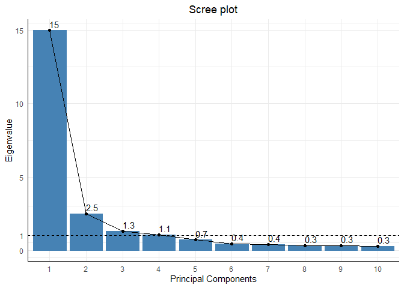
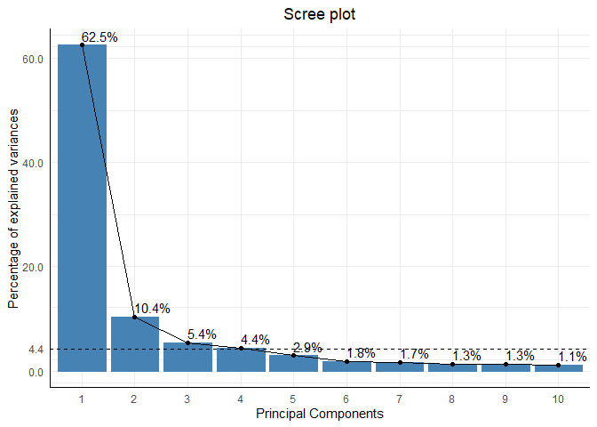
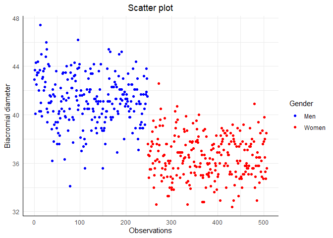
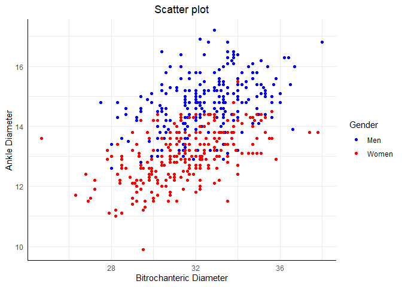
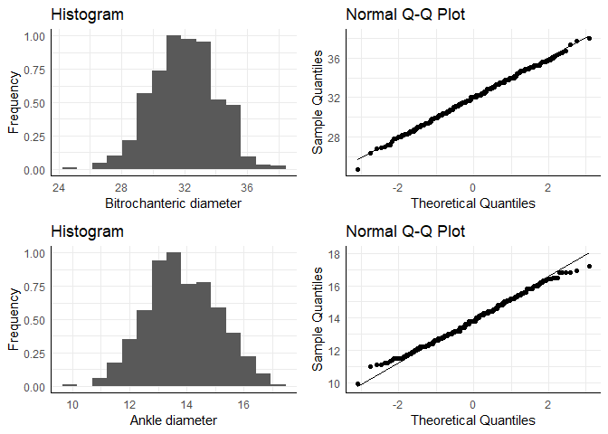
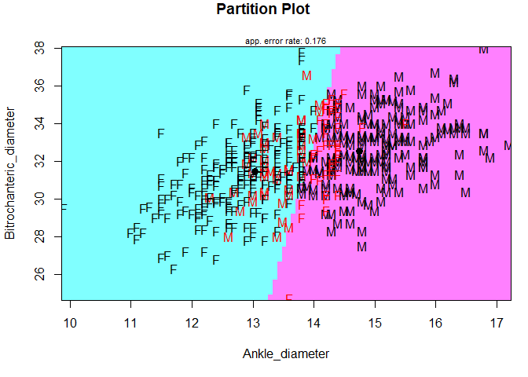

Multivariate Methods
================
Benjamin Sivac
2022-03-17

### Introduction

This report consists of two multivariate analyses upon data exploring
the relationships between body dimensions. The original authors who
collected the data and measurements sought to investigate and develop
predictive techniques for assessing the lean/fat body composition of
individuals. It was uploaded onto Journal of Statisics Education
(<http://jse.amstat.org/v11n2/datasets.johnson.html>) to provide
statistics students practice in data analysis, specifically multiple
regression and discriminant analysis. I myself decided to conduct both a
principal component analysis and a discriminant analysis, the former as
a way to reduce the number of variables and summarize it into fewer
variables, and the latter for discerning groups apart, in this case
between men and women.

### Data and packages

Loading packages with pre-built statistical tests, visualizations and
for general use.

``` r
library(ICSNP) # HotellingsT2
library(psych) # hmm
library(MASS) # LDA
library(HDtest) # LC-test
library(mvnormtest) # Multivariate normality test
library(tidyverse)
library(cowplot) # grid plots
library("devtools") 
library("factoextra") #Scree plot for eigenvalues
library(caret) #confusion matrix
library(klaR) #partition plot
```

The data is in a .txt file which we add headers onto and create a table
consisting of descriptive statistics for each of them.

``` r
df.body <- read.table("body.dat.txt", header = FALSE, sep = "", fill = TRUE)
colnames(df.body) <- c("Biacromial_diameter", "Biiliac_diameter", 
                      "Bitrochanteric_diameter", "Chest_depth_diameter",
                      "Chest_diameter", "Elbow_diameter", "Wrist_diameter", 
                      "Knee_diameter", "Ankle_diameter", "Shoulder_girth", 
                      "Chest_girth", "Waist_girth", "Abdominal_girth", 
                      "Hip_girth", "Thigh_girth", "Bicep_girth","Forearm_girth",
                      "Knee_girth", "Calf_girth", "Ankle_girth", "Wrist_girth",
                      "Age", "Weight", "Height", "Gender")

table <- subset(describe(df.body), select = c(mean, sd, min, max, range))
table[,6] <- table$sd^2
colnames(table) <- c("mean", "sd", "min", "max", "range", "var")
(table)
```

    ##                           mean    sd   min   max range    var
    ## Biacromial_diameter      38.81  3.06  32.4  47.4  15.0   9.36
    ## Biiliac_diameter         27.83  2.21  18.7  34.7  16.0   4.87
    ## Bitrochanteric_diameter  31.98  2.03  24.7  38.0  13.3   4.12
    ## Chest_depth_diameter     19.23  2.52  14.3  27.5  13.2   6.33
    ## Chest_diameter           27.97  2.74  22.2  35.6  13.4   7.52
    ## Elbow_diameter           13.39  1.35   9.9  16.7   6.8   1.83
    ## Wrist_diameter           10.54  0.94   8.1  13.3   5.2   0.89
    ## Knee_diameter            18.81  1.35  15.7  24.3   8.6   1.82
    ## Ankle_diameter           13.86  1.25   9.9  17.2   7.3   1.56
    ## Shoulder_girth          108.20 10.37  85.9 134.8  48.9 107.64
    ## Chest_girth              93.33 10.03  72.6 118.7  46.1 100.55
    ## Waist_girth              76.98 11.01  57.9 113.2  55.3 121.28
    ## Abdominal_girth          85.65  9.42  64.0 121.1  57.1  88.81
    ## Hip_girth                96.68  6.68  78.8 128.3  49.5  44.63
    ## Thigh_girth              56.86  4.46  46.3  75.7  29.4  19.89
    ## Bicep_girth              31.17  4.25  22.4  42.4  20.0  18.04
    ## Forearm_girth            25.94  2.83  19.6  32.5  12.9   8.01
    ## Knee_girth               36.20  2.62  29.0  49.0  20.0   6.85
    ## Calf_girth               36.08  2.85  28.4  47.7  19.3   8.11
    ## Ankle_girth              22.16  1.86  16.4  29.3  12.9   3.47
    ## Wrist_girth              16.10  1.38  13.0  19.6   6.6   1.91
    ## Age                      30.18  9.61  18.0  67.0  49.0  92.32
    ## Weight                   69.15 13.35  42.0 116.4  74.4 178.11
    ## Height                  171.14  9.41 147.2 198.1  50.9  88.50
    ## Gender                    0.49  0.50   0.0   1.0   1.0   0.25

We find the data set to include 21 body dimensions, measured in
centimeters, on 247 men and 260 women, amounting to 507 observations.
Among these dimensions are 9 skeletal- and 12 girth measurements, but
also age, weight, height, and gender. Their age ranges primarily between
the twenties and thirties with a few older participants, each confirmed
to be attending fitness clubs and exercising several hours a week. Among
the list are 3 perhaps more obscure measurements; Biacromial, Biiliac,
and Bitrochanteric. They, in the same order, correspond to the skeletal
distance between shoulders, between outer edges of the pelvis, and
between the outer points of the hips.
<p align="center">
  
</p>
### Principal component analysis

The goal of Principal components analysis is to reduce the number of
observed variables by creating new, linearly combined ones, referred to
as principal components, that explains the maximum variance out of the
old variables. We’ll first get 24 components, one for each original
variable, and decide on how many to retain by a set of guidelines: by
following the eigenvalue greater-than-one rule, identifying the “elbow”
in a scree plot, investigating explained individual- and cumulative
variance, and determining significant values of loadings (above .5). By
observing our table, we can see that variance differs a lot which
requires us to standardize the data before performing PCA. If we don’t,
the ones with bigger variance will get bigger weights which would imply
greater importance. This is done by subtracting the mean and dividing by
the standard deviation for each value of each variable. Once done, they
will be transformed to the same scale.

We start off by first discarding the one categorical variable, Gender,
from our data. Then we perform the principal component analysis for
centered means and standardized variances.

``` r
# Discarding the one categorical variable in our data.
df.sub <- df.body %>% subset(select = -c(Gender))

# Perform PCA with centered mean values and put SCALE = TRUE for standardizing
list_pca <- df.sub %>% prcomp(center=TRUE, scale = TRUE)

list_pca$scale # Variance of the variables
```

    ##     Biacromial_diameter        Biiliac_diameter Bitrochanteric_diameter 
    ##                3.059132                2.206308                2.030916 
    ##    Chest_depth_diameter          Chest_diameter          Elbow_diameter 
    ##                2.515877                2.741650                1.352906 
    ##          Wrist_diameter           Knee_diameter          Ankle_diameter 
    ##                0.944361                1.347595                1.247351 
    ##          Shoulder_girth             Chest_girth             Waist_girth 
    ##               10.374834               10.027621               11.012688 
    ##         Abdominal_girth               Hip_girth             Thigh_girth 
    ##                9.424128                6.680623                4.459889 
    ##             Bicep_girth           Forearm_girth              Knee_girth 
    ##                4.246941                2.830579                2.617570 
    ##              Calf_girth             Ankle_girth             Wrist_girth 
    ##                2.847661                1.862337                1.380931 
    ##                     Age                  Weight                  Height 
    ##                9.608472               13.345762                9.407205

With Variance lowered by a great deal, we can now check how many
principal components to retain by following our 5 guidelines.

``` r
# Scree plot, shows eigenvalue for each respective PC:
list_pca %>% fviz_eig(choice = "eigenvalue", addlabels = TRUE) +
  labs(x = "Principal Components") +
  scale_y_continuous(breaks = c(0,1,5,10,15)) +
  geom_hline(yintercept = 1, linetype = "dashed") +
  theme_minimal() + 
  theme(axis.line = element_line(colour = "black"),
        plot.title = element_text(hjust = 0.5))
```
<p align="center">

</p>
The first four eigenvalues fulfill the greater-than-one rule. If we
adhere to it, we would retain the four components. But looking at the
“elbow” of the scree plot, it’s clear that it starts at the second
eigenvalue which, contrary to the previous criteria, suggests that we
keep two principal components instead of four.

``` r
# proportion of variance:
list_pca %>% fviz_eig(addlabels = TRUE) +
  labs(x = "Principal Components") +
  scale_y_continuous(breaks = c(0,4.4,20,40,60)) +
  geom_hline(yintercept = 4.17, linetype = "dashed") +
  theme_minimal() + 
  theme(axis.line = element_line(colour = "black"),
        plot.title = element_text(hjust = 0.5))
```
<p align="center">

</p>
``` r
# Cumulative variance output:
get_eigenvalue(list_pca)$cumulative.variance.percent
```

    ##  [1]  62.48721  72.89241  78.27730  82.70483  85.63682  87.44861  89.13184
    ##  [8]  90.48130  91.76460  92.90686  93.98654  94.89793  95.73680  96.46346
    ## [15]  97.10969  97.71286  98.22043  98.64303  99.00286  99.33758  99.56992
    ## [22]  99.76248  99.91692 100.00000

For both the explained variances and the cumulative explained variances,
there’s no absolute cut-off value to follow other than wanting it to be
high as possible for as few as possible. However, we do at least want
them to explain themselves, which is about 4.17%. Looking at variance
explained, we find that the first four principal components makes it
over the threshold, the first one explaining a majority of the data and
the fourth one explaining just enough at 4.4%. As for the cumulative
variance explained, 73% is explained by two components and 83% by four
components. We will likely proceed with only two as opposed to four
since we value fewer components.

We also need to check loadings, which are the correlations between the
original variables and the newly formed variables. By observing their
values, we can discern how large and influential the original variables
are in forming the new variables.

``` r
scores <- list_pca$x[,1:2] # PC scores.
scores[,1:2] %>% cor(df.sub[,1:24]) # loadings for the first 2 PC's
```

    ##     Biacromial_diameter Biiliac_diameter Bitrochanteric_diameter
    ## PC1          -0.7821349       -0.4958090              -0.6894282
    ## PC2           0.3656767       -0.4884363              -0.4206393
    ##     Chest_depth_diameter Chest_diameter Elbow_diameter Wrist_diameter
    ## PC1          -0.79978502     -0.8602682     -0.8681026     -0.8342995
    ## PC2           0.00603838      0.1766528      0.3064420      0.3125223
    ##     Knee_diameter Ankle_diameter Shoulder_girth Chest_girth Waist_girth
    ## PC1    -0.8179576     -0.8000166     -0.9041516  -0.9134669 -0.88595138
    ## PC2    -0.0176457      0.2380181      0.2316593   0.1489710 -0.07607155
    ##     Abdominal_girth  Hip_girth Thigh_girth Bicep_girth Forearm_girth Knee_girth
    ## PC1      -0.6859884 -0.7213077  -0.4958269  -0.8953647    -0.9106866 -0.7970687
    ## PC2      -0.5255923 -0.6185557  -0.6970513   0.1553545     0.2390179 -0.3039712
    ##     Calf_girth Ankle_girth Wrist_girth        Age      Weight     Height
    ## PC1 -0.7788389 -0.80768734  -0.8850588 -0.2601469 -0.97281017 -0.7276052
    ## PC2 -0.2489627 -0.02744809   0.2998743 -0.1540559 -0.07805618  0.2927532

Adhering to the .5 threshold, we see that the first principal has large
loadings for next to all variables, similarly can be said for the second
component but for fewer variables. Both do walk the line at .5 for the
Biiliac diameter and they both do have low loadings for the Age
variable, which could likely be explained by a third component if we
were to include it.

### Discriminant analysis

Discriminant analysis is a technique used to identify the so-called best
set of variables, known as discriminator variables, that are used for
discerning where an observation belongs between two different groups. It
also utilizes a discriminant function for calculating discriminant
scores and classifying future observations into said two groups. The
Biacromial measurement is, according to an article associated with this
data, said to be a very discriminant variable for classifying gender
which is what we will evaluate first. A scatter plot is a good way to
start with when doing discriminant analysis. This plot can be used to
assess the extent to which ratios discriminate between the two groups.

``` r
# Scree plot of Biacromial_diameter between men and women.
df.body %>% ggplot(aes(seq_along(Biacromial_diameter), Biacromial_diameter, color=as.factor(Gender))) + 
  geom_point() + 
  labs(x="Observations",
  y = "Biacromial diameter",
  title="Scatter plot") +
  scale_color_manual(name = "Gender",
  values = c( "1" = "blue", "0" = "red"),
  labels = c("Men", "Women")) +
  theme_minimal() + 
  theme(axis.line = element_line(colour = "black"), 
        plot.title = element_text(hjust = 0.5))
```
<p align="center">

</p>
It looks fairly discriminant between men and women. We’ll confirm that
the means of the two groups are significantly different with respect to
the variable. We do so by performing Hotelling’s two sample T2-test, a
generalized t-statistic that is used in multivariate hypothesis testing.

``` r
# two-group T-test.
HotellingsT2(as.matrix(df.body[(1:247),1]),as.matrix(df.body[(248:507),1])) 
```

    ## 
    ##  Hotelling's two sample T2-test
    ## 
    ## data:  as.matrix(df.body[(1:247), 1]) and as.matrix(df.body[(248:507), 1])
    ## T.2 = 759.22, df1 = 1, df2 = 505, p-value < 2.2e-16
    ## alternative hypothesis: true location difference is not equal to c(0)

We find that the p-value is very low which rejects the null-hypothesis
of equal means, indicating that the difference is significant between
genders and performing a discriminant analysis might be suitable.

Both the multivariate t-test and linear discriminant analysis assumes
equal variances and normal distribution, we shall therefore perform
Shapiro Wilk’s test to control for multivariate normality and check the
univariate normal distribution for each variable through residual plots.
Additionally, we’ll need to perform LC-test to check for equal
covariance matrices, as the calculations for posterior probabilities
relies on that assumption. Violation of these assumptions would
compromise the significance tests and any following classification
results.

``` r
# LC-test for equality of covariance:
testCov(df.body[(1:247),1], df.body[(248:507),1])[4]
```

    ## [[1]]
    ## 
    ##  Two-Sample LC test
    ## 
    ## data:  df.body[(1:247), 1] and df.body[(248:507), 1]
    ## Statistic = 5.1739, p-value = 1.146e-07
    ## alternative hypothesis: two.sided

``` r
# shapiro-Wilk normality test:
mshapiro.test(t(as.matrix(df.body[,1])))
```

    ## 
    ##  Shapiro-Wilk normality test
    ## 
    ## data:  Z
    ## W = 0.98079, p-value = 3.122e-06

``` r
# Check for normality in residuals:
plot_qq <- df.body %>% ggplot(aes(sample = Biacromial_diameter)) + 
  stat_qq() + 
  stat_qq_line() +
  labs(title = "Normal Q-Q Plot", x = "Theoretical Quantiles", 
       y = "Sample Quantiles") + 
  theme_minimal() + 
  theme(text = element_text(size=17),
        axis.line = element_line(colour = "black"))

plot_hist <- df.body %>% ggplot(aes(Biacromial_diameter)) + 
  geom_histogram(aes(y = ..ncount..), bins = 15) +
  labs(title = "Histogram", x = "Biacromial diameter", y = "Frequency") + 
  theme_minimal() + 
  theme(text = element_text(size=17),
        axis.line = element_line(colour = "black"),
        plot.title = element_text(hjust = 0.5))

plot_grid(plot_hist, plot_qq, ncol = 2)
```
<p align="center">

</p>
While the null-hypothesis is not rejected in the LC-test, the
distribution plots seem a bit skewed and the test statistic for the
shapiro-Wilk normality test is not significant enough to claim
multivariate normality. We shall therefore go back and reevaluate each
variable in the data set.

If we can’t assume that the data are multivariate normally distributed,
the method discriminant analysis should not be used. At least if the
deviation is too big. We shall therefore loop through each variable into
Shapiro-Wilk’s test.

``` r
for (i in 1:24) 
  {
    if (mshapiro.test(t(as.matrix(df.body[,i])))$p.value > 0.05)
    {
      cat(colnames(df.body[i]),
          ", p-value =", 
          mshapiro.test(t(as.matrix(df.body[,i])))$p.value, 
          "\n") 
    }
}
```

    ## Bitrochanteric_diameter , p-value = 0.7928441 
    ## Ankle_diameter , p-value = 0.09594954

We find that the measures of Bitrochanteric and Ankles are the only two
variables with p-values above 0.05. Meaning that they are not
significantly different from normal distribution and will give accurate
results moving forward.

Now let’s find out if they make good candidates for becoming
discriminator variables.

``` r
df.body %>% ggplot(aes(Bitrochanteric_diameter, Ankle_diameter, color=as.factor(Gender))) + 
  geom_point() + 
  labs(x="Bitrochanteric Diameter",
  y = "Ankle Diameter",
  title = "Scatter plot") +
  scale_color_manual(name = "Gender",
  values = c( "1" = "blue", "0" = "red"),
  labels = c("Men", "Women")) +
  theme_minimal()+ 
  theme(axis.line = element_line(colour = "black"),
        plot.title = element_text(hjust = 0.5))
```
<p align="center">

</p>
The plot between the two variables shows ankle measurement to be
somewhat discriminant on the y-axis while not particularly for
bitrochanteric on the x-axis, or jointly for that matter.

Let’s double check that our assumptions may hold true for our new
subjects.

``` r
# Plots to check for normality:
q2 <- df.body %>% ggplot(aes(sample = Bitrochanteric_diameter)) + 
  stat_qq() + 
  stat_qq_line() +
  labs(title = "Normal Q-Q Plot", 
       x = "Theoretical Quantiles", 
       y = "Sample Quantiles") +
  theme_minimal() + 
  theme(axis.line = element_line(colour = "black"))

h2 <- df.body %>% ggplot(aes(Bitrochanteric_diameter)) + 
  geom_histogram(aes(y = ..ncount..), bins = 15) +
  labs(title = "Histogram", 
       x = "Bitrochanteric diameter", 
       y = "Frequency") + 
  theme_minimal() + 
  theme(axis.line = element_line(colour = "black"))

q3 <- df.body %>% ggplot(aes(sample = Ankle_diameter)) + 
  stat_qq() + 
  stat_qq_line() +
  labs(title = "Normal Q-Q Plot", 
       x = "Theoretical Quantiles", 
       y = "Sample Quantiles") + 
  theme_minimal() + 
  theme(axis.line = element_line(colour = "black"))

h3 <- df.body %>% ggplot(aes(Ankle_diameter)) + 
  geom_histogram(aes(y = ..ncount..), bins = 15) +
  labs(title = "Histogram", 
       x = "Ankle diameter", 
       y = "Frequency") + 
  theme_minimal() + 
  theme(axis.line = element_line(colour = "black"))

plot_grid(h2, q2, h3, q3, ncol = 2)
```
<p align="center">

</p>
``` r
# two-group T-test.
HotellingsT2(as.matrix(df.body[(1:247),3,9]),as.matrix(df.body[(248:507),3,9]))
```

    ## 
    ##  Hotelling's two sample T2-test
    ## 
    ## data:  as.matrix(df.body[(1:247), 3, 9]) and as.matrix(df.body[(248:507), 3, 9])
    ## T.2 = 37.347, df1 = 1, df2 = 505, p-value = 1.978e-09
    ## alternative hypothesis: true location difference is not equal to c(0)

``` r
# Check for equality of covariance matrices:
testCov(df.body[(1:247),3], df.body[(248:507),3])[4]
```

    ## [[1]]
    ## 
    ##  Two-Sample LC test
    ## 
    ## data:  df.body[(1:247), 3] and df.body[(248:507), 3]
    ## Statistic = 1.179, p-value = 0.1192
    ## alternative hypothesis: two.sided

``` r
# Check for equality of covariance matrices:
testCov(df.body[(1:247),9], df.body[(248:507),9])[4] 
```

    ## [[1]]
    ## 
    ##  Two-Sample LC test
    ## 
    ## data:  df.body[(1:247), 9] and df.body[(248:507), 9]
    ## Statistic = 0.97007, p-value = 0.166
    ## alternative hypothesis: two.sided

The p-value from the Hotelling’s T2 test is very low, indicating that
the difference is significant between genders. The null hypothesis for
equality of covariance matrices is not rejected, meaning they are equal
and satisfactory. We also find their respective plots to be well
distributed.

We can now proceed with computing the linear discriminant analysis. It
first estimates the weight vectors of the discriminant function, so that
the difference between within and between group variance is maximized.
That way, it creates linear combinations of the predictors which enables
it to predict the groups.

``` r
# lda:
fit <-lda(Gender ~ Bitrochanteric_diameter + Ankle_diameter, data=df.body)
fit
```

    ## Call:
    ## lda(Gender ~ Bitrochanteric_diameter + Ankle_diameter, data = df.body)
    ## 
    ## Prior probabilities of groups:
    ##         0         1 
    ## 0.5128205 0.4871795 
    ## 
    ## Group means:
    ##   Bitrochanteric_diameter Ankle_diameter
    ## 0                31.46154       13.02654
    ## 1                32.52672       14.74413
    ## 
    ## Coefficients of linear discriminants:
    ##                                LD1
    ## Bitrochanteric_diameter -0.1029221
    ## Ankle_diameter           1.1872311

At the end of this output, values -0.1029221 and 1.1872311 are shown
which are the weights in the equation


The normalized coefficients can be calculated as

``` r
# Our normalized coefficients manually calculated:
w1=(fit$scaling[1,1]/(sqrt(fit$scaling[1,1]^2+fit$scaling[2,1]^2)))
w1
```

    ## [1] -0.08636695

``` r
w2=(fit$scaling[2,1]/(sqrt(fit$scaling[1,1]^2+fit$scaling[2,1]^2)))
w2
```

    ## [1] 0.9962634

We can now classify each observation by either posterior probabilities
or by discriminant scores. The posterior probabilities are given by P(G,
D), where G represents the group and D is the cutoff value, a value
which is based on the average of the Zs in each group. Given prior
probabilities, an observation will be classified by the highest
posterior probability between the two groups. We find the probabilities
through following code

``` r
# Change 1's to M for male and 0's to F for female
df.body$Gender <- ifelse(df.body$Gender=="1", "M", "F") 
# CV = TRUE returns posterior probabilities of the output.
fit_cv <-lda(Gender ~ Bitrochanteric_diameter + Ankle_diameter, data=df.body,CV=TRUE)
fit_cv$posterior
```

    ##               F            M
    ## 1   0.369269180 0.6307308201
    ## 2   0.081144576 0.9188554240
    ## 3   0.456380040 0.5436199605
    ## 4   0.109321547 0.8906784530
    ## 5   0.133703655 0.8662963455
    ## 6   0.480881439 0.5191185609
    ## 7   0.030080321 0.9699196793
    ## 8   0.207075892 0.7929241076
    ## 9   0.840693242 0.1593067584
    ....

For example, we can see the posterior probabilities of observation 9
between the men and women are, respectively, 84% and 16%. It will
therefore be misclassified as a woman. As for using discriminant scores,
we can with the help of a cutoff value determine whether an observation
in the data belongs to the male or female group. We assign an
observation to the male group if


and assign to female group if


We can utilise a confusion matrix as a summary of the classification
results to see the number of observations correctly classified and
missclassified. These are computed by simply running the training data
back through the discriminant function to see how they get classified.

``` r
# we need to fit the model again without CV=TRUE
fit <-lda(Gender ~ Bitrochanteric_diameter + Ankle_diameter, data=df.body)

# Confusion matrix to determine performance of our discriminant variables.
confusionMatrix(as.factor(df.body$Gender),as.factor(predict(fit)$class))
```

    ## Confusion Matrix and Statistics
    ## 
    ##           Reference
    ## Prediction   F   M
    ##          F 218  42
    ##          M  47 200
    ##                                           
    ##                Accuracy : 0.8245          
    ##                  95% CI : (0.7885, 0.8566)
    ##     No Information Rate : 0.5227          
    ##     P-Value [Acc > NIR] : <2e-16          
    ##                                           
    ##                   Kappa : 0.6485          
    ##                                           
    ##  Mcnemar's Test P-Value : 0.6716          
    ##                                           
    ##             Sensitivity : 0.8226          
    ##             Specificity : 0.8264          
    ##          Pos Pred Value : 0.8385          
    ##          Neg Pred Value : 0.8097          
    ##              Prevalence : 0.5227          
    ##          Detection Rate : 0.4300          
    ##    Detection Prevalence : 0.5128          
    ##       Balanced Accuracy : 0.8245          
    ##                                           
    ##        'Positive' Class : F               
    ## 

Here we see that out of our 507 observations, 16% were misclassified as
men and 19% as women. The overall error rate ends up at about 17.5%.

We can visualize the results through a partition plot, where colored
regions delineate each classification area.

``` r
partimat(as.factor(Gender) ~ Bitrochanteric_diameter + Ankle_diameter, data=df.body, method="lda")
```
<p align="center">

</P>
### Interpretation of results

#### Principal Component Analysis

From the results we may interpret the first principal component as
having strong correlation to measures concerning upper body and size of
frame, while the second principal component would refer to the
measurements around upper legs. Meaning when investigating the
relationships between men and women, the variables can be summarised as
measurements of upper body, including overall size, and secondly upper
legs. There’s also a likely case of including a third component to
explain the age variable, but it does not have any strong correlations
to other measurements and would only explain itself, making principal
component analysis redundant and pointless.

#### Discriminant Analysis

With few acceptable variables to choose from, bitrochanteric diameter
and ankle diameter proved to have pretty significant discriminant power
at only 17.5% error rate, suggesting a 82.5% accuracy for predicting
observations between men and women. Looking at the scatter plot for
Ankle diameter leaves us to believe that it alone could have a
substantial discriminant power amongst our data. It could also be seen
in the discriminant function that the weight of Bitrochanteric diameter
is a lot smaller compared to the very big value of Ankle diameter,
reflecting it’s relative small effect on the results.

### Conclusion

Principal components analysis proved to be an useful technique for
reducing the number of variables, from 24 down to 2 (3 if we include the
third component to be a 1:1 substitute for the Age variable), the first
component measuring upper body and overall size, second being
measurements around the upper thighs. As for the Discriminant Analysis,
we conclude ankle diameter to have strong discriminate power, along with
Bitriochanteric diameter, at 82.5% accuracy. However, considering the
data, close to all variables did not satisfy the multivariate normality
assumption, unless we don’t utilize posterior probabilities, which
limited the choice of variables and prevented us from discovering which
body measures are, in reality, the most useful in determining the gender
of an individual. In retrospect, using logistic regression would have
circumvented the multivariate normality requirement and given us an
opportunity to compare models of fit between variables and decide the
best one.
