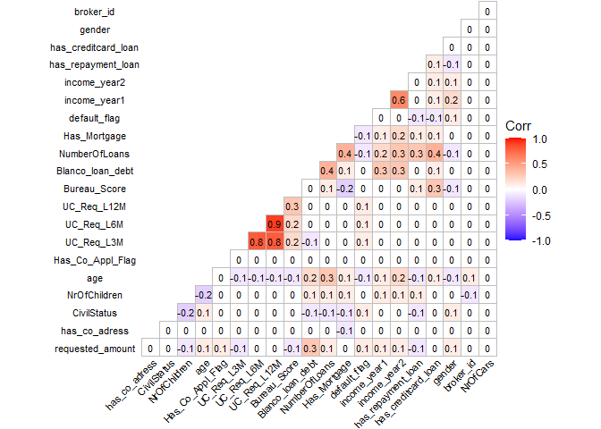
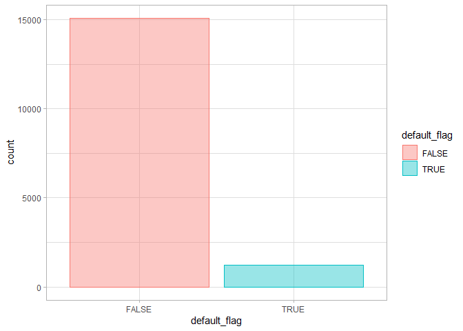
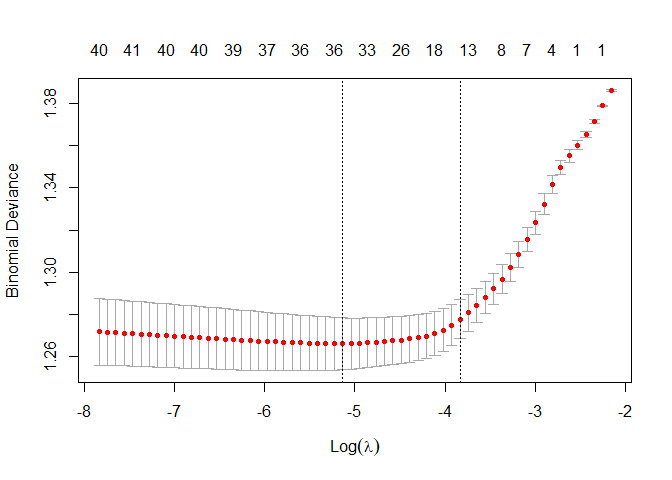

Predicting Default for Refinance Loan Applications
================
Benjamin Sivac
2022-05-31

# Introduction

In this dataset you will find consumer loan applications and the outcome
flag for these applications (default flag).

**Task:** Build a logistic regression model that predicts probability of
default for **refinance loans.** Explain and present your model, explain
the selection of variables, and discuss the data limitations. Explain
what can be improved in your model and discuss data limitations.

## Data

Below is a description of the dataset variables.

-   **ApplicationDate** - Date of application (MMYYYY)
-   **Blanco\_loan\_debt** - Blanco loan debt (SEK)
-   **Bureau\_Score** - Credit score from the bureau
-   **CivilStatus** - Married/Single/Cohabiting
-   **Has\_Co\_Appl\_Flag** - 1 if co-applicant exist, else 0
-   **Has\_Mortgage** - 1 if applicant has a mortgage loan
-   **NrOfCars** - Number of cars registered on the applicant
-   **NrOfChildren** - Number of children
-   **NumberOfLoans** - Number of loans (all loan types)
-   **UC\_Req\_L12M** - Number of loan requests done past 12m
-   **UC\_Req\_L3M** - Number of loan requests done past 6m
-   **UC\_Req\_L6M** - Number of loan requests done past 3m
-   **age** - Age
-   **broker\_id** - Id of the broker that the applicant used when
    applying
-   **default\_flag** - 1= default, 0= not defaulted within 12m from
    application date
-   **gender** - “F”=Female, “M”=Male
-   **has\_co\_adress** - 1 if applicant has a C/O-address, else 0
-   **has\_creditcard\_loan** - 1 if applicant has at least one credit
    card loan, else 0
-   **has\_repayment\_loan** - 1 if applicant has at least one repayment
    loan, else 0
-   **income\_year1** - Gross income most recent income year
-   **income\_year2** - Gross income past income year
-   **requested\_amount** - Total amount requested to loan
-   **refinance\_flag** - 1= Refinance loan, 0 = Not a refinance loan

In short, we have to *filter by refinance\_flag = 1* to keep our
analysis limited to refinance loans, and predict the dependent binary
variable **default\_flag** in relation to the other variables.

## Data Wrangling

We’ll load a few necessary packages beforehand, tidyverse and lubridate,
knowing that we’ll most certainly work with data manipulation and date
types.

``` r
library(tidyverse)
library(lubridate)
```

Once we have all the libraries necessary, we can read the data in from
CSV file.

``` r
theme_set(theme_light())
df.loan_apps <- read.csv("case_data.csv", sep=";")
glimpse(df.loan_apps)
```

    ## Rows: 25,000
    ## Columns: 23
    ## $ ApplicationDate     <int> 52019, 52019, 52019, 52019, 52019, 52019, 52019, 5~
    ## $ requested_amount    <int> 30000, 50000, 100000, 150000, 70000, 170000, 40000~
    ## $ has_co_adress       <int> 0, 0, 0, 1, 0, 0, 0, 0, 0, 0, 0, 0, 0, 0, 0, 0, 0,~
    ## $ CivilStatus         <chr> "Married", "Single", "Cohabiting", "Cohabiting", "~
    ## $ NrOfChildren        <int> 1, 0, 1, 1, 0, 1, 1, 0, 0, 0, 0, 0, 1, 1, 0, 0, 0,~
    ## $ age                 <int> 33, 29, 40, 37, 61, 29, 26, 21, 57, 30, 59, 58, 47~
    ## $ Has_Co_Appl_Flag    <int> 0, 0, 0, 0, 0, 0, 0, 0, 0, 0, 0, 0, 0, 0, 0, 0, 0,~
    ## $ UC_Req_L3M          <int> 7, 6, 2, 8, 1, 1, 4, 1, 5, 1, 20, 3, 16, 6, 9, 2, ~
    ## $ UC_Req_L6M          <int> 16, 8, 3, 12, 2, 2, 6, 4, 10, 2, 24, 6, 22, 16, 18~
    ## $ UC_Req_L12M         <int> 19, 12, 5, 22, 3, 5, 9, 9, 13, 5, 32, 9, 44, 40, 4~
    ## $ Bureau_Score        <dbl> 7.7, 6.9, 6.2, 11.7, 3.8, 4.5, 3.2, 16.8, 10.2, 3.~
    ## $ Blanco_loan_debt    <int> 337110, 244400, 605395, 132021, 379851, 757197, 14~
    ## $ NumberOfLoans       <int> 8, 6, 19, 5, 10, 3, 7, 4, 4, 3, 9, 18, 8, 9, 5, 9,~
    ## $ Has_Mortgage        <int> 1, 0, 0, 0, 0, 0, 1, 0, 0, 0, 1, 0, 0, 0, 0, 1, 1,~
    ## $ default_flag        <int> 0, 0, 0, 0, 0, 0, 0, 0, 0, 0, 0, 0, 0, 0, 0, 0, 0,~
    ## $ income_year1        <chr> "$274,100.00", "$231,600.00", "$248,900.00", "$278~
    ## $ income_year2        <chr> "$142,300.00", "$82,100.00", "$255,800.00", "$34,4~
    ## $ refinance_flag      <int> 0, 0, 1, 1, 1, 1, 1, 0, 0, 1, 1, 1, 0, 0, 0, 0, 0,~
    ## $ has_repayment_loan  <int> 1, 1, 1, 0, 0, 0, 0, 1, 0, 1, 0, 1, 1, 0, 1, 0, 0,~
    ## $ has_creditcard_loan <int> 1, 1, 1, 1, 1, 1, 1, 1, 0, 0, 1, 1, 1, 1, 1, 1, 1,~
    ## $ gender              <chr> "M", "M", "F", "F", "M", "M", "F", "M", "F", "M", ~
    ## $ broker_id           <int> 10, 14, 14, 14, 10, 10, 10, 10, 10, 13, 16, 8, 10,~
    ## $ NrOfCars            <int> 4, 4, 5, 1, 3, 10, 4, 2, 1, 2, 3, 0, 5, 4, 8, 6, 2~

The data consists of 25000 rows with 23 columns. By observe that several
columns need to be converted; the applicationDate to date format, the
CivilStatus and gender to factors, each flag -and “has” variable to
logical data types, and finally remove the dollar signs from previous
years gross income and convert to numeric.

``` r
df.clean <- df.loan_apps %>% 
  mutate(ApplicationDate = format(parse_date_time(ApplicationDate, orders = c("m/Y")), "%m/%Y"),
         CivilStatus = as.factor(CivilStatus),
         gender = as.factor(gender),
         across(starts_with("has"), as.logical),
         across(ends_with("flag"), as.logical),
         across(starts_with("income_year"), 
                ~gsub("[$,]", "", .) %>% 
                as.numeric))
glimpse(df.clean)
```

    ## Rows: 25,000
    ## Columns: 23
    ## $ ApplicationDate     <chr> "05/2019", "05/2019", "05/2019", "05/2019", "05/20~
    ## $ requested_amount    <int> 30000, 50000, 100000, 150000, 70000, 170000, 40000~
    ## $ has_co_adress       <lgl> FALSE, FALSE, FALSE, TRUE, FALSE, FALSE, FALSE, FA~
    ## $ CivilStatus         <fct> Married, Single, Cohabiting, Cohabiting, Single, C~
    ## $ NrOfChildren        <int> 1, 0, 1, 1, 0, 1, 1, 0, 0, 0, 0, 0, 1, 1, 0, 0, 0,~
    ## $ age                 <int> 33, 29, 40, 37, 61, 29, 26, 21, 57, 30, 59, 58, 47~
    ## $ Has_Co_Appl_Flag    <lgl> FALSE, FALSE, FALSE, FALSE, FALSE, FALSE, FALSE, F~
    ## $ UC_Req_L3M          <int> 7, 6, 2, 8, 1, 1, 4, 1, 5, 1, 20, 3, 16, 6, 9, 2, ~
    ## $ UC_Req_L6M          <int> 16, 8, 3, 12, 2, 2, 6, 4, 10, 2, 24, 6, 22, 16, 18~
    ## $ UC_Req_L12M         <int> 19, 12, 5, 22, 3, 5, 9, 9, 13, 5, 32, 9, 44, 40, 4~
    ## $ Bureau_Score        <dbl> 7.7, 6.9, 6.2, 11.7, 3.8, 4.5, 3.2, 16.8, 10.2, 3.~
    ## $ Blanco_loan_debt    <int> 337110, 244400, 605395, 132021, 379851, 757197, 14~
    ## $ NumberOfLoans       <int> 8, 6, 19, 5, 10, 3, 7, 4, 4, 3, 9, 18, 8, 9, 5, 9,~
    ## $ Has_Mortgage        <lgl> TRUE, FALSE, FALSE, FALSE, FALSE, FALSE, TRUE, FAL~
    ## $ default_flag        <lgl> FALSE, FALSE, FALSE, FALSE, FALSE, FALSE, FALSE, F~
    ## $ income_year1        <dbl> 274100, 231600, 248900, 278000, 283000, 357600, 23~
    ## $ income_year2        <dbl> 142300, 82100, 255800, 34400, 264800, 394100, 2104~
    ## $ refinance_flag      <lgl> FALSE, FALSE, TRUE, TRUE, TRUE, TRUE, TRUE, FALSE,~
    ## $ has_repayment_loan  <lgl> TRUE, TRUE, TRUE, FALSE, FALSE, FALSE, FALSE, TRUE~
    ## $ has_creditcard_loan <lgl> TRUE, TRUE, TRUE, TRUE, TRUE, TRUE, TRUE, TRUE, FA~
    ## $ gender              <fct> M, M, F, F, M, M, F, M, F, M, F, M, F, F, M, M, F,~
    ## $ broker_id           <int> 10, 14, 14, 14, 10, 10, 10, 10, 10, 13, 16, 8, 10,~
    ## $ NrOfCars            <int> 4, 4, 5, 1, 3, 10, 4, 2, 1, 2, 3, 0, 5, 4, 8, 6, 2~

Are there any obvious data augmentation to be made? Similar to credit
scores, there are other ratios that I presume could lessen the number
constraints on the model, such as debt-to-income, loan-to-value, annual
percentage rate, etc. However, I must confess that I am ill informed in
this area and I would much rather work with what we got. It might as
well prove to be redundant. As such, we’ll stick with the current set of
variables.

## Exploratory data analysis

Let us begin by having a look at the number of missing values:

``` r
sapply(df.clean, function(x) sum(is.na(x)))
```

    ##     ApplicationDate    requested_amount       has_co_adress         CivilStatus 
    ##                   0                   0                   0                   0 
    ##        NrOfChildren                 age    Has_Co_Appl_Flag          UC_Req_L3M 
    ##                   0                   0                   0                   0 
    ##          UC_Req_L6M         UC_Req_L12M        Bureau_Score    Blanco_loan_debt 
    ##                   0                   0                   0                   0 
    ##       NumberOfLoans        Has_Mortgage        default_flag        income_year1 
    ##                   0                   0                   0                1224 
    ##        income_year2      refinance_flag  has_repayment_loan has_creditcard_loan 
    ##                   0                   0                   0                   0 
    ##              gender           broker_id            NrOfCars 
    ##                   0                   0                   0

The variable income\_year1 is the only one with missing values,
reassuring us that values of 0 within the data are not to be confused
with actual missing values. The question now is whether or not we should
remove rows with missing values or perhaps remove income\_year1
entirely, since it could very likely be correlated with income\_year2.

Let’s remove the 1224 rows with missing values but also take a peek at
the correlation matrix of our data.

``` r
df.refinance <- df.clean %>% filter(refinance_flag==TRUE) %>%
  na.omit() %>% 
  dplyr::select(-refinance_flag)

df.refinance %>% select(-ApplicationDate) %>% 
  mutate(gender=as.numeric(gender),
         CivilStatus=as.numeric(CivilStatus)) %>% 
  cor() %>% ggcorrplot::ggcorrplot(lab=TRUE,
                                   lab_size = 3,
                                   digits = 1, 
                                   type = "lower",
                                   ggtheme = ggplot2::theme_void,
                                   tl.cex = 8)
```

<!-- -->

We find that both the number of requests for loans across past months
and the past reported incomes have considerable high correlations. I’m
hesitant to remove either variables since we are not dealing with
perfect collinearity, but it might be an option for improving our future
model. It’s also worth noting that certain models can “infer” this in
feature selection and remove useless variables.

Let’s take a quick look at our dependent variable:

``` r
df.refinance %>% group_by(default_flag) %>% 
  summarise(count = n()) %>% 
  ggplot(aes(default_flag, count, fill=default_flag, color = default_flag)) +
  geom_bar(stat="identity", alpha=0.4)
```

<!-- -->

``` r
prop.table(table(df.refinance$default_flag))
```

    ## 
    ##      FALSE       TRUE 
    ## 0.92495402 0.07504598

This is an issue. Having big imbalances in the data wont provide our
model with enough neccessary information about the minority class, in
this case for the applications that end up defaulting, as the model
strives to minimize error in which the minority class contributes very
little, resulting in biased predictions and misleading accuracies.

As a fix, let’s perform random undersampling! It’s a method for reducing
the number of observations from the majority class as a way to balance
out the dataset.

``` r
t <- which(df.refinance$default_flag==TRUE)
f <- which(df.refinance$default_flag==FALSE)
f.downsample <- sample(f, length(t))
df.refinance_down <- df.refinance[c(f.downsample, t),]

df.refinance_down %>% group_by(default_flag) %>% 
  summarise(count = n())
```

    ## # A tibble: 2 x 2
    ##   default_flag count
    ##   <lgl>        <int>
    ## 1 FALSE         1224
    ## 2 TRUE          1224

``` r
prop.table(table(df.refinance_down$default_flag))
```

    ## 
    ## FALSE  TRUE 
    ##   0.5   0.5

There are also “Informative” undersampling methods with both an
unsupervised and supervised learning algorithm, but we’ll settle for the
quick, random undersampling method.

## Analysis

My first thought was to perform a stepwise logistic regression model for
obtaining the best variables, since that is what I’m most familiar with
from my time studying statistics. However, I’ve found multiple online
resources suggesting that stepwise model selection is a cause for
overfitting, by having coefficients that are too large and resulting in
a highly biased outcome with nonreliable accuracy.

Now since we do have a few correlated variables, a down sampled dataset,
and are asked to perform and also motivate feature selection, **using
LASSO** would be a good choice. It is a Regularization method which
penalizes large coefficients and can specifically perform estimation on
very small sample sizes, implement cross validation for tuning a
hyperparameter, as a way for balancing bias and variance, and computes a
simpler model by forcing coefficients of lesser contributive variables
to be zero.

We split the data into a training set (75%) for estimating parameters
and another set reserved for testing and evaluation (25%).

``` r
set.seed(2022)
library(tidymodels)
library(glmnet)
library(caret)

split <- initial_split(df.refinance_down)
train <- training(split)
test <- testing(split)

x.train <- model.matrix(default_flag~., train)[,-15]
y.train <- train$default_flag

x.test <- model.matrix(default_flag~., test)[,-15]
y.test <- test$default_flag
```

LASSO is a penalized regression which utilises a constant lambda for
adjusting the amount of coefficient shrinkage, by optimizing lambda
through iterations we can minimize the cross validation prediction error
rate. We’ll use the default value of 10 blocks for cross validation.

``` r
cv.lasso <- cv.glmnet(x.train, y.train, family = "binomial", alpha = 1, nfolds = 10, keep = TRUE)
plot(cv.lasso)
```

<!-- -->

The left dashed vertical line is the optimal log value of lambda for
minimizing prediction error, and the right one is for the simplest model
within one standard error of the optimal model, in other words the best
balance between accuracy and simplicity. The values are:

``` r
cv.lasso$lambda.min
```

    ## [1] 0.005879131

``` r
cv.lasso$lambda.1se
```

    ## [1] 0.02162568

We proceed to fit the final models with their respective lambda values
onto the training data to find which regression coefficients are best.

``` r
model.1se <- glmnet(x.train, y.train, alpha = 1, family = "binomial", 
                lambda = cv.lasso$lambda.1se)
coef(model.1se)
```

    ## 43 x 1 sparse Matrix of class "dgCMatrix"
    ##                                    s0
    ## (Intercept)              1.982659e-01
    ## (Intercept)              .           
    ## ApplicationDate01/2021   .           
    ## ApplicationDate02/2020   .           
    ## ApplicationDate02/2021   .           
    ## ApplicationDate03/2020   .           
    ## ApplicationDate04/2020   .           
    ## ApplicationDate05/2019   .           
    ## ApplicationDate05/2020   .           
    ## ApplicationDate06/2019   2.831649e-02
    ## ApplicationDate06/2020   .           
    ## ApplicationDate07/2019   .           
    ## ApplicationDate07/2020   .           
    ## ApplicationDate08/2019   .           
    ## ApplicationDate08/2020   .           
    ## ApplicationDate09/2020  -1.033246e-01
    ## ApplicationDate10/2019   .           
    ## ApplicationDate10/2020   .           
    ## ApplicationDate11/2019   .           
    ## ApplicationDate11/2020   .           
    ## ApplicationDate12/2019   .           
    ## ApplicationDate12/2020   .           
    ## requested_amount         1.438499e-06
    ## has_co_adressTRUE        3.314339e-02
    ## CivilStatusMarried       .           
    ## CivilStatusSingle        4.648621e-02
    ## NrOfChildren            -3.912330e-02
    ## age                     -1.071788e-02
    ## Has_Co_Appl_FlagTRUE    -2.501295e-01
    ## UC_Req_L3M               2.030904e-02
    ## UC_Req_L6M               .           
    ## UC_Req_L12M              8.260559e-03
    ## Bureau_Score             .           
    ## Blanco_loan_debt         .           
    ## NumberOfLoans           -2.251796e-02
    ## Has_MortgageTRUE        -8.602283e-01
    ## income_year1             .           
    ## income_year2             .           
    ## has_repayment_loanTRUE  -1.443296e-01
    ## has_creditcard_loanTRUE -7.569018e-02
    ## genderM                  1.581836e-01
    ## broker_id               -1.734494e-03
    ## NrOfCars                 .

There are 16 coefficients remaining, the rest have been shrunken down to
0. Amongst these coefficients, increasing the likelihood of defaulting
on a refinance loan is dependent on the requested amount, if you are
single, if you have requested a loan in recent months, and if you are a
male. The remaining coefficients decrease the likelihood on defaulting
which pertain mostly to people who have grown old, started a family, and
who are financially stable enough to having already acquired several
loans under their name. There are also a few select months that affect
the predictions in both ways.

``` r
model.min <- glmnet(x.train, y.train, alpha = 1, family = "binomial",
                lambda = cv.lasso$lambda.min)
coef(model.min)
```

    ## 43 x 1 sparse Matrix of class "dgCMatrix"
    ##                                    s0
    ## (Intercept)              3.744981e-01
    ## (Intercept)              .           
    ## ApplicationDate01/2021   .           
    ## ApplicationDate02/2020  -1.205398e-01
    ## ApplicationDate02/2021   .           
    ## ApplicationDate03/2020   5.470382e-02
    ## ApplicationDate04/2020  -3.293865e-01
    ## ApplicationDate05/2019  -1.699565e-01
    ## ApplicationDate05/2020  -9.061400e-02
    ## ApplicationDate06/2019   3.556806e-01
    ## ApplicationDate06/2020  -2.536260e-01
    ## ApplicationDate07/2019   4.223497e-02
    ## ApplicationDate07/2020  -2.267769e-01
    ## ApplicationDate08/2019   3.955344e-02
    ## ApplicationDate08/2020  -8.675094e-02
    ## ApplicationDate09/2020  -3.877551e-01
    ## ApplicationDate10/2019   1.002153e-01
    ## ApplicationDate10/2020  -4.242997e-02
    ## ApplicationDate11/2019  -1.585041e-01
    ## ApplicationDate11/2020   2.276894e-01
    ## ApplicationDate12/2019   1.889152e-01
    ## ApplicationDate12/2020  -1.706599e-01
    ## requested_amount         2.001285e-06
    ## has_co_adressTRUE        3.352304e-01
    ## CivilStatusMarried       1.832913e-01
    ## CivilStatusSingle        2.438624e-01
    ## NrOfChildren            -1.047507e-01
    ## age                     -1.626469e-02
    ## Has_Co_Appl_FlagTRUE    -1.391109e+00
    ## UC_Req_L3M               2.718994e-02
    ## UC_Req_L6M               .           
    ## UC_Req_L12M              1.231534e-02
    ## Bureau_Score             2.292126e-03
    ## Blanco_loan_debt         .           
    ## NumberOfLoans           -1.962518e-02
    ## Has_MortgageTRUE        -1.050854e+00
    ## income_year1             4.565780e-09
    ## income_year2             .           
    ## has_repayment_loanTRUE  -2.500438e-01
    ## has_creditcard_loanTRUE -2.096536e-01
    ## genderM                  2.325245e-01
    ## broker_id               -1.821264e-02
    ## NrOfCars                -2.810123e-03

This is the model with the smallest achieved MSE which is also
considered the most accurate model. It’s likely similar to a full model
in terms of accuracy since LASSO only shrinks useless variables and it
is close to being completely unrestricted.

Let’s create predictions onto the test data, by using the fitted
probabilities, and examine model accuracy and the confusion matrix.

``` r
# fitting predictions
prob.min <- predict(model.min, newx = x.test, type = "response")
prob.1se <- predict(model.1se, newx = x.test, type = "response")

pred.min <- ifelse(prob.min > 0.5, "TRUE", "FALSE")
pred.1se <- ifelse(prob.1se > 0.5, "TRUE", "FALSE")

# Model accuracy
mean(pred.min == test$default_flag)
```

    ## [1] 0.6683007

``` r
mean(pred.1se == test$default_flag)
```

    ## [1] 0.6650327

The models differ by 2%, having 68.6% and 66.6% accuracy respectively,
but the .1se model is simpler with a lot fewer predictors.

``` r
# confusion matrix for the .se1 model
cnf <- cv.glmnet(x.train, y.train, alpha = 1, family = "binomial")
confusion.glmnet(cnf, newx = x.test, newy = y.test)
```

    ##          True
    ## Predicted FALSE TRUE Total
    ##     FALSE   189   81   270
    ##     TRUE    124  218   342
    ##     Total   313  299   612
    ## 
    ##  Percent Correct:  0.665

The confusion matrix tells us how many instances whose correct default
status was missclassified for the other. In binary classification, the
diagonal entries are commonly referred to as the true positives and the
true negatives, and the other two are the false positives and false
negatives.

## Discussing models and data limitations

Generic takes; LASSO is better for feature selection or sparse model
selection. Ridge regression may give better prediction since it uses all
variables. If an outcome is better predicted by many weak predictors,
then ridge regression or bagging/boosting will outperform both forward
stepwise regression and LASSO by a long shot. LASSO is much faster than
forward stepwise regression.

Concerning whether or not income\_year1 and income\_year2 are in fact
reported in dollars or just a typo, I would personally assume that it is
in fact a typo since the other variables are reported in SEK which would
be more in line with the other figures in terms of value, however, I do
confess that I lack the necessary domain knowledge and would normally
consult someone else in a real life scenario. If they are in fact
reported correctly I would consider it a data limitation, as I assume
having variables with different currencies makes it no longer comparable
since they are on different scales, and I would instead implement a
column for conversion rates between the two currency at the time of
date, which I would also drill down in the applicationDate field.

Other shortcomings; the data is missing interest rate, as blanco loans
are usually higher with a wide range that likely has a predictive power.
Similarly, a loan term could also be useful as it determines not only
how long the borrower will be in debt, but how high the borrower’s
monthly loan payments and overall loan costs will be. Another variable
that might prove helpful, but generic, is education level of the
applicant, but also of the co-applicant since we are already have a flag
for it. Might as well add co-applicant income.
