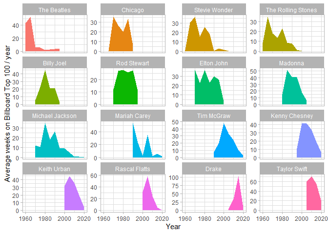

Tidy Tuesday: Billboard 100
================
Benjamin Sivac
2022-05-27

# Introduction

This EDA is done by following a video uploaded by an esteemed R-user
named David Robinsson. I figured it would be a great opportunity for me
to see another analyst’s approach to EDA and how he applies more
advanced techniques. I’ll aim to describe and explain every step of the
way to understand for both the reader and myself.

## Data & Exploratory data analysis

The data comes from Data.World by way of Sean Miller, Billboard.com and
Spotify. The Billboard Hot 100 is the music industry standard record
chart in the United States for songs, published weekly by Billboard
magazine. Chart rankings are based on sales (physical and digital),
radio play, and online streaming in the United States.

``` r
library(tidyverse)
library(scales)
library(lubridate)
theme_set(theme_light())
df.bb100 <- readr::read_csv('https://raw.githubusercontent.com/rfordatascience/tidytuesday/master/data/2021/2021-09-14/billboard.csv')
df.af <- readr::read_csv('https://raw.githubusercontent.com/rfordatascience/tidytuesday/master/data/2021/2021-09-14/audio_features.csv')
```

Let’s have our first look at the data.

``` r
df.bb100 %>% glimpse()
```

    ## Rows: 327,895
    ## Columns: 10
    ## $ url                    <chr> "http://www.billboard.com/charts/hot-100/1965-0~
    ## $ week_id                <chr> "7/17/1965", "7/24/1965", "7/31/1965", "8/7/196~
    ## $ week_position          <dbl> 34, 22, 14, 10, 8, 8, 14, 36, 97, 90, 97, 97, 9~
    ## $ song                   <chr> "Don't Just Stand There", "Don't Just Stand The~
    ## $ performer              <chr> "Patty Duke", "Patty Duke", "Patty Duke", "Patt~
    ## $ song_id                <chr> "Don't Just Stand TherePatty Duke", "Don't Just~
    ## $ instance               <dbl> 1, 1, 1, 1, 1, 1, 1, 1, 1, 1, 1, 1, 1, 1, 1, 1,~
    ## $ previous_week_position <dbl> 45, 34, 22, 14, 10, 8, 8, 14, NA, 97, 90, 97, 9~
    ## $ peak_position          <dbl> 34, 22, 14, 10, 8, 8, 8, 8, 97, 90, 90, 90, 90,~
    ## $ weeks_on_chart         <dbl> 4, 5, 6, 7, 8, 9, 10, 11, 1, 2, 3, 4, 5, 6, 1, ~

This dataset already has a few interesting aggregated columns for each
performer and his/her respective song; weekly number, number of
instances it has appeared on the billboard, positions on the chart, and
a variable for cumulative weeks on the chart. We will first fix the
week\_id variable as it needs to be converted into a date format.

``` r
df.bb100 <- df.bb100 %>% 
  mutate(week = mdy(week_id)) %>% 
  select(-week_id)
```

Let’s find out which songs have remained at number 1 position the
longest.

``` r
(longest_top_song <- df.bb100 %>% 
  filter(week_position==1) %>% 
  count(song_id, song, performer, sort= TRUE))
```

    ## # A tibble: 1,124 x 4
    ##    song_id                                                 song  performer     n
    ##    <chr>                                                   <chr> <chr>     <int>
    ##  1 Old Town RoadLil Nas X Featuring Billy Ray Cyrus        Old ~ Lil Nas ~    19
    ##  2 DespacitoLuis Fonsi & Daddy Yankee Featuring Justin Bi~ Desp~ Luis Fon~    16
    ##  3 One Sweet DayMariah Carey & Boyz II Men                 One ~ Mariah C~    16
    ##  4 Candle In The Wind 1997/Something About The Way You Lo~ Cand~ Elton Jo~    14
    ##  5 I'll Make Love To YouBoyz II Men                        I'll~ Boyz II ~    14
    ##  6 I Gotta FeelingThe Black Eyed Peas                      I Go~ The Blac~    14
    ##  7 I Will Always Love YouWhitney Houston                   I Wi~ Whitney ~    14
    ##  8 Macarena (Bayside Boys Mix)Los Del Rio                  Maca~ Los Del ~    14
    ##  9 Uptown Funk!Mark Ronson Featuring Bruno Mars            Upto~ Mark Ron~    14
    ## 10 We Belong TogetherMariah Carey                          We B~ Mariah C~    14
    ## # ... with 1,114 more rows

Let’s find any patterns across time for these songs.

``` r
df.bb100 %>% 
  semi_join(head(longest_top_song, 9), by = "song_id") %>% 
  ggplot(aes(week, week_position, group = instance)) +
  geom_line() +
  facet_wrap(~song, scales="free_x") +
  scale_y_reverse() +
  labs(x="Time",
       y="Billboard position",
       title = "Trajectories of #1 hits")
```

<!-- -->

Most songs seem to rapidly reach the number 1 spot and remain for 3-4
months before slowly losing placements by the following 6 months.

Let’s evaluate the performers by how many songs and for how long they
have been at top 100 and number 1 respectively.

``` r
summarize_songs <- function(tbl) {
  tbl %>% 
    summarize(total_weeks_on_top100 = n(),
            total_weeks_at_number1 = sum(week_position == 1),
            n_songs_top100 = n_distinct(song),
            n_songs_at_number1 = n_distinct(song[week_position==1]),
            .groups = "drop") %>% 
  arrange(desc(total_weeks_at_number1))
}

(by_performer <- df.bb100 %>% 
  group_by(performer) %>% 
  summarize_songs())
```

    ## # A tibble: 10,061 x 5
    ##    performer   total_weeks_on_~ total_weeks_at_~ n_songs_top100 n_songs_at_numb~
    ##    <chr>                  <int>            <int>          <int>            <int>
    ##  1 Mariah Car~              621               65             32               16
    ##  2 The Beatles              585               54             65               19
    ##  3 Boyz II Men              331               34             17                4
    ##  4 Madonna                  857               32             53               12
    ##  5 Drake                    746               31             99                5
    ##  6 Whitney Ho~              561               31             32               11
    ##  7 Michael Ja~              611               30             41               11
    ##  8 The Black ~              382               28             15                3
    ##  9 Bee Gees                 516               27             43                9
    ## 10 Adele                    301               24             13                4
    ## # ... with 10,051 more rows

We can create a scatter plot to observe how many songs each performer
got at number 1 out of their total number of songs in the top 100.

``` r
by_performer %>% 
  arrange(desc(n_songs_top100)) %>% 
  ggplot(aes(n_songs_top100, n_songs_at_number1)) +
  geom_point() +
  labs(x = "# of songs on the billboard top 100",
       y="# of songs at #1") +
  geom_text(aes(label=performer), check_overlap = TRUE, vjust = 1, hjust = 1) +
  expand_limits(x=-10)
```

<!-- -->

There’s a pretty high concentration of performers within the range of 1
to 7 songs at number 1 out of 10 to 50 at top100 songs.

It is also reasonable to observe stats by decade and also see which
performer had the best numbers by each decade.

``` r
(by_performer_decade <- df.bb100 %>% 
  group_by(performer, 
           decade = 10 * year(week) %/% 10) %>% 
  summarize_songs())
```

    ## # A tibble: 12,069 x 6
    ##    performer             decade total_weeks_on_~ total_weeks_at_~ n_songs_top100
    ##    <chr>                  <dbl>            <int>            <int>          <int>
    ##  1 The Beatles             1960              478               50             56
    ##  2 Mariah Carey            1990              386               42             17
    ##  3 Boyz II Men             1990              327               34             16
    ##  4 Drake                   2010              683               29             89
    ##  5 Bee Gees                1970              333               27             23
    ##  6 The Black Eyed Peas     2000              244               26             11
    ##  7 Adele                   2010              294               24             12
    ##  8 Michael Jackson         1980              266               20             17
    ##  9 Usher                   2000              206               20             10
    ## 10 Elvis Presley With T~   1960              394               19             47
    ## # ... with 12,059 more rows, and 1 more variable: n_songs_at_number1 <int>

``` r
by_performer_decade %>% 
  group_by(decade) %>% 
  slice_max(total_weeks_at_number1, n = 1)
```

    ## # A tibble: 8 x 6
    ## # Groups:   decade [8]
    ##   performer           decade total_weeks_on_top~ total_weeks_at_~ n_songs_top100
    ##   <chr>                <dbl>               <int>            <int>          <int>
    ## 1 Bobby Darin           1950                  72                9              5
    ## 2 The Beatles           1960                 478               50             56
    ## 3 Bee Gees              1970                 333               27             23
    ## 4 Michael Jackson       1980                 266               20             17
    ## 5 Mariah Carey          1990                 386               42             17
    ## 6 The Black Eyed Peas   2000                 244               26             11
    ## 7 Drake                 2010                 683               29             89
    ## 8 Roddy Ricch           2020                  36               11              1
    ## # ... with 1 more variable: n_songs_at_number1 <int>

We can visualize which performer had the most average weeks on the
billboard per 5 year periods, by lumping together top 16 performers,
filtering out the rest/“Other”, and utilizing an area plot. We also use
facet wrap to make it more readable.

``` r
df.bb100 %>% 
  mutate(performer_lumped = fct_lump(performer, 16)) %>% 
  count(performer_lumped,
        year = 5 * year(week) %/% 5) %>% 
  filter(performer_lumped != "Other") %>% 
  mutate(performer_lumped = fct_reorder(performer_lumped, year)) %>% 
  ggplot(aes(year, n/5, fill = performer_lumped)) + 
  geom_area() +
  facet_wrap(~performer_lumped, scales="free_y") +
  scale_fill_discrete(guide="none") +
  labs(x = "Year", 
       y = "Average weeks on Billboard Top 100 / year")
```

<!-- -->

Next is to perform ML for predicting each song’s popularity by number of
weeks!

## Machine Learning

We’ll utilise XGBoost to predict log\_n\_weeks by certain stats and
characteristics found in the audio\_features data, which we’ll join
together by an inner join.

``` r
(by_song <- df.bb100 %>% 
  group_by(song_id) %>% 
  summarize(peak=max(week_position),
            week_started = min(week),
            n_weeks = n(),
            log_n_weeks = log2(n_weeks)))
```

    ## # A tibble: 29,389 x 5
    ##    song_id                                 peak week_started n_weeks log_n_weeks
    ##    <chr>                                  <dbl> <date>         <int>       <dbl>
    ##  1 '03 Bonnie & ClydeJay-Z Featuring Bey~    56 2002-10-26        23        4.52
    ##  2 '65 Love AffairPaul Davis                100 1982-02-27        20        4.32
    ##  3 '98 Thug ParadiseTragedy, Capone, Inf~    99 1998-09-19         5        2.32
    ##  4 'Round We GoBig Sister                   100 1996-04-06         2        1   
    ##  5 'til I Can Make It On My OwnTammy Wyn~   100 1976-05-01         5        2.32
    ##  6 'til It's Time To Say GoodbyeJonathan~    93 1976-01-10         9        3.17
    ##  7 'Til My Baby Comes HomeLuther Vandross    99 1985-03-16        16        4   
    ##  8 'Til Summer Comes AroundKeith Urban       94 2010-01-30        16        4   
    ##  9 'Til You Do Me RightAfter 7               71 1995-07-08        22        4.46
    ## 10 'TilThe Angels                            95 1961-10-14        15        3.91
    ## # ... with 29,379 more rows

``` r
songs_joined <- by_song %>%
  inner_join(df.af, by = "song_id") %>%
  filter(!is.na(spotify_track_id))
```

We perform an initial split to the data, creating a training set for
estimating parameters and a testing set for evaluating the machine
learning method, across 3 blocks for cross validation which is rather
few but we are only doing a quick test.

``` r
library(tidymodels)
library(textrecipes)

set.seed(2022)
split <- initial_split(songs_joined) #Initial data split
train <- training(split) #training set for estimating parameters
test <- testing(split) #testing set for evaluating the ML method
folds <- vfold_cv(train, 3) # Divide the data into 3 blocks for cross validation
```

Onto preprocessing our recipe; we include all attributes to a song but
also what genre it has been listed as on spotify, and what month they
hit the billboard. Using step\_mutate to adjust and clean the latter two
variables to fit, while also converting the genres into individual
variables through tokenization.

``` r
# Preprocessing "recipe"
xg_workflow <- recipe(log_n_weeks ~ danceability + energy + key + loudness + mode + speechiness +
         acousticness + instrumentalness + liveness + valence + tempo + time_signature +
         spotify_genre + week_started, data = train) %>% 
  step_mutate(month = month(week_started),
              # parse the genre
              spotify_genre = str_remove_all(spotify_genre, "\\['|'\\]")) %>% 
  step_rm(week_started) %>% 
  # create tokens as variables for each spotify genre
  step_tokenize(spotify_genre, token = "regex", options = list(pattern = "', '")) %>% 
  step_tokenfilter(spotify_genre, max_tokens = tune()) %>% 
  step_tf(spotify_genre) %>% 
  workflow(boost_tree("regression", # create a decision tree
                      mtry = tune(), # tunes hyperparameters (like booster parameters such as eta, gamma, and lambda)
                      trees=tune(),
                      learn_rate = .02))
tune <- xg_workflow %>% 
  tune_grid(folds,
            metrics = metric_set(rmse),
            grid = crossing(mtry = c(3, 5),
                            max_tokens = c(1,10,30),
                            trees = seq(25, 500, 25)))
autoplot(tune)
```

<!-- -->

We find that the amount of predictors have no effect on the estimated
rmse value while the number of tokens do.

We’ll select the best hyperparameters and perform an estimated rmse
value:

``` r
xg_fit <- xg_workflow %>%
  finalize_workflow(select_best(tune)) %>%
  fit(train)

xg_fit %>%
  augment(test) %>%
  rmse(log_n_weeks, .pred)
```

    ## # A tibble: 1 x 3
    ##   .metric .estimator .estimate
    ##   <chr>   <chr>          <dbl>
    ## 1 rmse    standard        1.23

Visualizing the fitted line through our test data.

``` r
xg_fit %>%
  augment(test) %>%
  ggplot(aes(2 ^ .pred, 2 ^ log_n_weeks)) +
  geom_point(alpha = .25) +
  geom_smooth(method = "lm") +
  scale_x_log10() +
  scale_y_log10() +
  labs(x = "Predicted weeks on top 100",
       y = "Actual weeks on top 100")
```

<!-- -->

## Interpreting the features

``` r
importances <- xg_fit %>%
  extract_fit_engine() %>%
  xgb.importance(mod = .)
importances %>%
  mutate(Feature = fct_reorder(Feature, Gain)) %>%
  ggplot(aes(Gain, Feature)) +
  geom_col() +
  labs(x = "Importance")
```

<!-- -->
